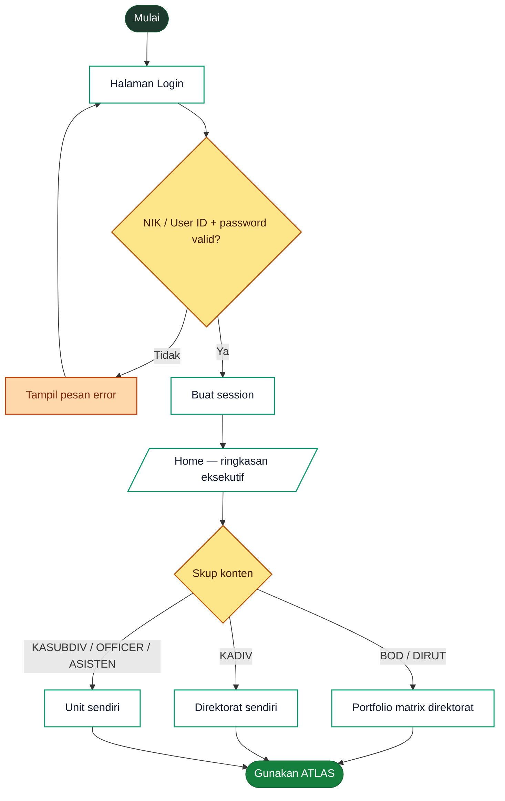
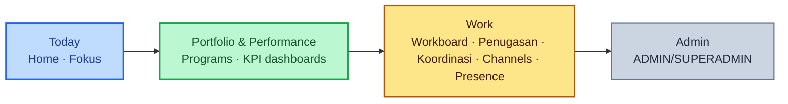
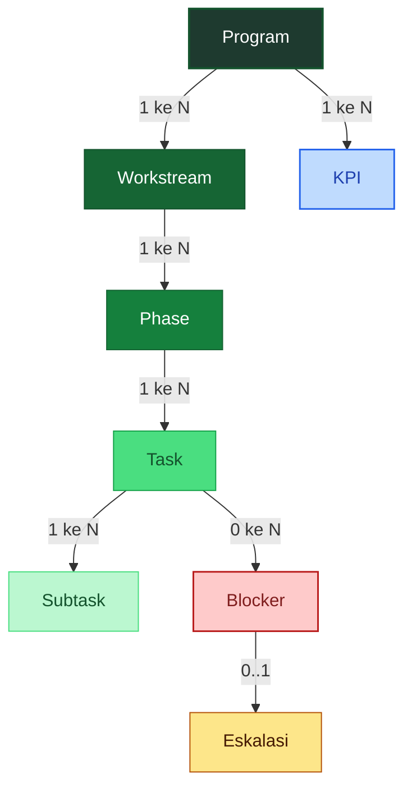
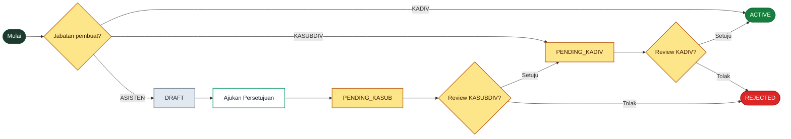
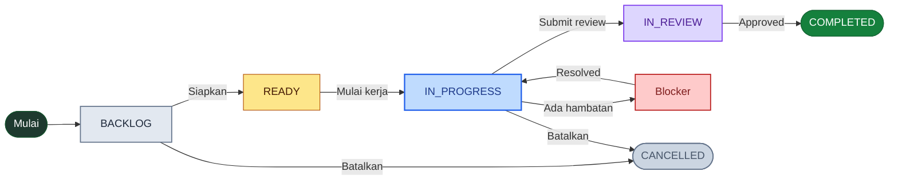
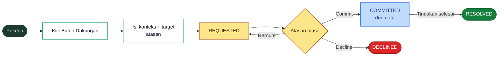
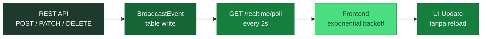
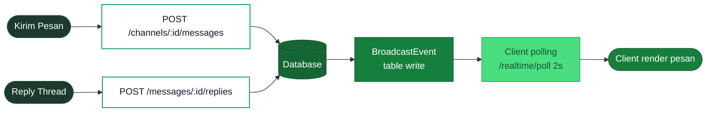

# ATLAS — Panduan Penggunaan & Evaluasi

> Panduan penggunaan ATLAS untuk seluruh tim — langkah-langkah operasional dari setiap fitur, mengikuti siklus PDCA (Plan-Do-Check-Act), dilengkapi catatan evaluasi implementasi untuk kebutuhan teknis.

## Referensi Jabatan

| Kode | Jabatan |
|------|---------|
| BOD | Direksi (termasuk Direktur Utama / DIRUT) |
| KADIV | Kepala Divisi (Direktur fungsional) |
| KASUBDIV | Kepala Sub-Divisi |
| ASISTEN | Asisten |
| OFFICER | Staff/Officer |
| ADMIN | Admin sistem |
| SUPERADMIN | Super admin |

## Glosarium Istilah

Vokabulari yang dipakai di seluruh ATLAS. Status program, atribut perencanaan, dan konsep platform — disusun supaya semua tim pakai istilah yang sama.

> 🔧 *Sejak 25 Juni 2026 seluruh label status punya **satu sumber kebenaran** di `resources/js/lib/status.ts` (helper `workStatusLabel` / `healthLabel` / `priorityLabel` / `severityLabel` / `programStatusLabel` / dst). Aturan emas: satu konsep → satu string; variasi visual (UPPERCASE, ikon) = presentasi turunan, bukan teks kedua. Semua label lewat **i18n bilingual** — UI default English, bisa di-switch ke Bahasa Indonesia via Settings → Language (lihat §20).*

> 💡 **Dua sumbu status — jangan dicampur.** (1) **Lifecycle / progress** menjawab "tugas ada di tahap pipeline mana?" → Backlog · Ready · In Progress · In Review · Completed. (2) **Jadwal / health** menjawab "sehat atau telat?" → On Track · At Risk · Delayed · Overdue · Completed. Sebuah program bisa **On Track** sementara sebagian task-nya masih **Backlog** — kedua sumbu independen.

### Status Program

Klasifikasi kondisi pelaksanaan program pada periode pelaporan.

| Istilah | Penjelasan |
|---------|------------|
| 🟢 **On Track** | Progress sesuai timeline dan tidak ada kendala signifikan. *Contoh: mayoritas aktivitas berjalan; deliverable bulanan terkirim tepat waktu.* |
| 🟡 **At Risk** | Terdapat kendala yang berpotensi menghambat timeline. Belum melewati deadline, tapi butuh perhatian. *Contoh: persetujuan stakeholder belum keluar; mitigasi dijalankan sebelum target tergeser.* |
| 🔴 **Terlambat (Delayed)** | Sudah melewati timeline atau target tidak tercapai pada periode pelaporan. *Contoh: deliverable utama belum keluar setelah deadline; perlu eskalasi & rencana pemulihan.* |
| 🔵 **Completed** | Program telah selesai dan seluruh output telah deliver. Tidak ada aktivitas yang masih open. |

### Status Pekerjaan (Task & Penugasan)

**Vocabulary lifecycle untuk pekerjaan individual** — dipakai di Workboard (Task) dan Penugasan. Sama persis lintas modul; tidak boleh divergen. Bedakan dari **Status Program** di atas (program = level strategis, pekerjaan = level operator). Label kanonik English (via `workStatusLabel`), terjemahan ID muncul saat user pilih Bahasa Indonesia.

| Label (EN) | Terjemahan (ID) | Enum DB | Kriteria masuk |
|------------|-----------------|---------|----------------|
| **Backlog** | Belum Direncanakan | `BACKLOG` | Task baru. Prasyarat (PIC, tanggal, plan) belum lengkap. *Hanya Task — Penugasan tidak punya tahap ini karena atasan sudah menjabarkan saat memberikan.* |
| **Ready** | Siap Dikerjakan | `READY` | Set-up lengkap (PIC + tanggal + rencana). Penugasan masuk di sini begitu diterima. |
| **In Progress** | Sedang Berjalan | `IN_PROGRESS` | Eksekusi jalan; `actualStartDate` tercatat. |
| **In Review** | Menunggu Review | `IN_REVIEW` | Selesai dari sisi PIC, menunggu approval reviewer (Penugasan; Execution tidak punya tahap review). |
| **Completed** | Selesai | `COMPLETED` | Done, bukti completion (link / catatan) tercatat. |
| **On Hold** | Ditahan | `ON_HOLD` | Dijeda sementara oleh keputusan (mis. tunggu input pihak eksternal). Tidak muncul sebagai kolom — flagged di kartu. |
| **Cancelled** | Dibatalkan | `CANCELLED` | Task dibatalkan, tidak akan dikerjakan. Disembunyikan dari board secara default. |

> 💡 **Hambatan bukan status terpisah** — task/penugasan tetap berada di kolom lifecycle-nya (mis. "In Progress"), dengan flag `isBlocked` yang memunculkan badge **⚠ Terhambat** di kartu. Progress historis (start date, dll) tidak hilang. *(Catatan: alias lama `DITUGASKAN` / `DIKERJAKAN` / `SELESAI` sudah di-deprecate — gunakan enum kanonik di atas.)*

### Status Jadwal & Urgensi (Health)

**Sumbu jadwal/health** — menjawab "sehat atau telat?". Dipakai oleh Health Score program, badge kartu, dan **menjadi kolom Board Workboard** (lihat §8). Label kanonik (English default, terjemahan ID via i18n):

| Label (EN) | Terjemahan (ID) | Arti |
|------------|-----------------|------|
| **On Track** | Sesuai Rencana | Progress sesuai timeline, tak ada kendala signifikan. *(enum health: GREEN)* |
| **At Risk** | Berisiko | Ada kendala / mendekati deadline / ber-blocker tapi belum lewat tempo — perlu diawasi. *(YELLOW + blocked-not-overdue)* |
| **Delayed** | Terlambat | Health merah: di belakang jadwal/target. *(RED)* |
| **Overdue** | Lewat Tempo | Deadline benar-benar sudah lewat & item belum selesai (rank 0 — paling kritis). |
| **Not Started** | Belum Mulai | Belum ada progress (kolom Board untuk task yang menunggu dikerjakan). |
| **Completed** | Selesai | Sudah tuntas. |

> 💡 **Overdue ≠ Delayed ≠ Late** — tiga kata yang dulu bertabrakan kini dipisah tegas di i18n: *Overdue* = **Lewat Tempo** (sudah lewat deadline), *Delayed* = **Terlambat** (health merah, belum tentu lewat tanggal), *Late* = **Lewat Tenggat** (badge "selesai tapi telat"). *Postponed* = **Diundur** (bukan lagi disamakan dengan On Hold "Ditunda").

### Aturan Penyebutan (Cheatsheet)

- **String sumber = English, lewat helper di `lib/status.ts`.** Jangan tulis label status manual di komponen — panggil `workStatusLabel` / `healthLabel` / `priorityLabel` / dst. i18n yang menerjemahkan ke Bahasa Indonesia saat user memilih ID di Settings → Language.
- **Health program** (sumbu jadwal): *On Track / At Risk / Delayed / Overdue / Completed* — terkunci sejak Sprint 1, kini satu sumber.
- **Lifecycle task & penugasan**: *Backlog / Ready / In Progress / In Review / Completed* — Title Case via `workStatusLabel`.
- **Program "running" = "Active"** (BUKAN "In Progress"). Beda altitude: program *Active* vs task *In Progress* — bantu user bedakan level (keputusan 25 Juni 2026).
- **Jangan render enum mentah** (`IN_PROGRESS`, `RED`, `HIGH`) ke UI — gate `npm run audit:status-labels` (bagian dari `npm run check`) menggagalkan build bila ada enum mentah baru bocor ke layar.
- **Jangan pakai** "Ditugaskan" / "Dikerjakan" / "Review" (deprecated 24 Mei 2026), atau fork health lama "Off Track" / "Critical" / "Healthy" (di-collapse ke On Track / Delayed, 25 Juni 2026). *Pengecualian sengaja:* KPI tetap pakai **"Off Track"** (domain berbasis-target, bukan jadwal).

### Istilah Program & Atribut

| Istilah | Penjelasan |
|---------|------------|
| **Program Kerja** | Kegiatan atau inisiatif yang direncanakan untuk mencapai target direktorat. Unit perencanaan terbesar di ATLAS. Satu Program dapat memiliki banyak Workstream. *Contoh: Audit Internal 2026.* |
| **Kelompok (Scorecard / Non-Scorecard)** | Scorecard = program yang kontribusinya diukur lewat KPI direktorat/divisi. Non-Scorecard = program enabler yang mendukung Scorecard. |
| **Pilar Strategis Keuangan** | Area strategis utama dalam pengelolaan keuangan. ATLAS menggunakan 5 pilar: Collecting More, Spending Better, Innovative Financing, Enabler, Non-Scorecard. |
| **Output / Laporan** | Hasil konkret dari program kerja. *Contoh: dokumen, surat, laporan, sistem, kebijakan.* |
| **Deadline** | Batas waktu penyelesaian output program kerja, dipilih dari tanggal yang disediakan saat planning. |
| **PIC (Person in Charge)** | Individu yang bertanggung jawab utama atas pelaksanaan program, workstream, atau task. Umumnya Kepala Sub Divisi. |
| **Assignee** | Pengguna yang ditugaskan untuk mengerjakan suatu Task. |
| **Progress Terkini** | Status realisasi program pada periode pelaporan. Format yang disarankan: "Status + % capaian + keterangan singkat". *Contoh: On Track 75% — penyusunan draft selesai, menunggu reviu DHKM.* |
| **Dukungan yang Dibutuhkan** | Permintaan bantuan spesifik agar program tetap on track, mengatasi kendala, atau dipercepat penyelesaiannya. Di ATLAS dapat diangkat lewat tombol "Butuh Dukungan Atasan". |
| **Penugasan** | Tugas ad-hoc di luar struktur Program — diberikan langsung dari atasan ke bawahan, biasanya disertai bukti penyelesaian (file/link/catatan). |

### Konsep ATLAS

| Istilah | Penjelasan |
|---------|------------|
| **PDCA** | Siklus *Plan-Do-Check-Act* — kerangka kerja sistem ATLAS untuk mengklasifikasi modul (Plan = Programs/Workstream, Do = Workboard/Penugasan, Check = Performance/Scorecard, Act = Rapat Koordinasi/Eskalasi). **Sejak 25 Mei 2026 navigasi sidebar di-organize berbasis *intent* (Today / Portfolio & Performance / Work / Admin), bukan fase PDCA** — agar lookup lebih cepat. PDCA tetap kerangka di balik layar (dipakai di playbook & dokumentasi untuk klasifikasi modul). |
| **Workstream** | Jalur kerja dalam satu Program — mengelompokkan Phase dan Task berdasarkan bidang atau tim. *Contoh: Audit Divisi Keuangan.* |
| **Phase** | Tahapan utama dalam sebuah Workstream. Mengelompokkan Task yang saling berkaitan. Tampil sebagai container bernomor di tab Struktur. *Contoh: Pengumpulan Dokumen.* |
| **Task** | Satu unit pekerjaan konkret di dalam sebuah Phase — memiliki status, assignee, prioritas, dan batas waktu. Muncul di **Workboard**. *Contoh: Kumpulkan laporan arus kas Q1.* |
| **Subtask** | Checklist langkah-langkah di dalam sebuah Task. Tidak berdiri sendiri dan tidak muncul di Papan Kerja. *Contoh: Email ke treasury minta data Januari.* |
| **KPI** | *Key Performance Indicator* — indikator kinerja terukur yang dipantau secara berkala. |
| **KPI Charter / Charter** | Tampilan satu halaman read-only Program — mirror format KPI Charter dengan tabel aktivitas bulanan, progress KPI, problem identification & corrective action, next step. |
| **PICA** | *Problem · Identification · Corrective action · Action* — kerangka kerja rapat koordinasi yang menelusuri hambatan dan tindakan korektif. Pasangan field di Progress Log: apa masalahnya, dan tindakan korektif apa yang sudah/akan dilakukan. |
| **Clear the Path** | Mekanisme eskalasi kendala ke atasan langsung. Otomatis routing ke supervisor, dengan opsi Commit / Reroute / Decline. |
| **Eskalasi** | Permintaan dukungan ke atasan untuk membuka hambatan kerja (lihat *Clear the Path*). Bisa dibuat dari Blocker, Progress Log, Action Item, atau ad-hoc. |
| **Blocker** | Hambatan yang menghalangi penyelesaian task — perlu dilaporkan agar PIC & atasan dapat menindaklanjuti. |
| **Health Score** | Indikator kesehatan program (Green / Yellow / Red) yang dihitung otomatis dari workstream, KPI, task overdue, dan blocker aktif. |
| **Scorecard** | Ringkasan ranking capaian KPI seluruh direktorat & divisi — surface eksekutif di modul Performance. |
| **RSVP** | Konfirmasi kehadiran rapat: Hadir, Tidak Hadir, atau Delegasi (menunjuk pengganti). |
| **Action Items** | Daftar tindak lanjut yang disepakati dalam rapat, lengkap dengan penanggung jawab dan batas waktu. |
| **Thread** | Rangkaian balasan dalam satu pesan di Channel — agar diskusi tidak campur dengan pesan lain. |

## Alur Proses Sistem

> 🔧 *Bagian ini ditujukan untuk developer TI — menggambarkan alur proses utama sistem ATLAS secara visual agar mudah dipahami saat onboarding, debugging, atau pengembangan fitur baru.*

### 1. Alur Autentikasi & Navigasi Awal

Login menggunakan **NIK atau User ID** (bukan email). Setelah berhasil, seluruh pengguna mendarat di halaman **Home** — konten Home bersifat *role-aware* (otomatis menyesuaikan ringkasan ke skup jabatan).

### 2. Sidebar (Intent-based)

Sejak 25 Mei 2026 sidebar ATLAS di-organize berbasis **intent pengguna** (bukan fase PDCA) agar lookup cepat. Grup & item bersifat *role-aware* — pengguna hanya melihat menu yang relevan untuk jabatannya. **Today** (Home + Fokus) di-pin paling atas; **Profile & Settings** pindah ke popover avatar (sidebar footer), bukan lagi grup tersendiri.

### 3. Hierarki Entitas Data

Hubungan antar entitas utama di ATLAS — dari Program sampai Subtask.

### 4. Alur Approval Program

Pembuatan program melewati alur persetujuan berjenjang sesuai jabatan pembuat.

### 5. Alur Eksekusi Task

Siklus hidup sebuah Task mulai dari pembuatan hingga selesai.

### 6. Alur Eskalasi (Clear the Path)

Eskalasi membuka jalur cepat ke atasan saat pekerjaan terhambat.

### 7. Alur Real-Time (Polling)

Setiap mutasi data ditulis ke `BroadcastEvent` table; frontend polling `/realtime/poll` setiap 2 detik untuk fetch event baru. SSE sebelumnya di-drop (19 Mei 2026) karena di FrankenPHP setiap koneksi SSE menahan 1 thread PHP — tidak scalable di hosting shared.

### 8. Alur Komunikasi (Channel & DM)

Pesan dikirim melalui REST, disimpan di database, lalu di-broadcast ke seluruh subscriber channel.

---

## 1. Masuk & Keluar Sistem

**Siapa yang bisa:** Semua pengguna

### Cara Login

1. Buka ATLAS di browser — masuk ke halaman login
2. Masukkan **NIK** atau **User ID** Anda (bukan email)
3. Masukkan **password**, lalu klik **Masuk**
4. Sistem akan mengarahkan Anda ke halaman **Home** — ringkasan eksekutif yang otomatis menyesuaikan skup jabatan Anda

> 💡 **Lupa password?** Hubungi admin sistem untuk reset — halaman self-service reset belum tersedia.

### Cara Logout

1. Klik inisial/foto profil Anda di pojok kanan atas
2. Pilih **Keluar** dari menu
3. Anda akan kembali ke halaman login secara otomatis

**Status: ✅ Lengkap**

> 🔧 *Catatan teknis: Login mendukung NIK atau User ID (bukan email). Token sesi tidak memiliki expiry time — berlaku selama akun aktif di database. Halaman reset password self-service (frontend) belum dibuat.*

## 2. Navigasi Sidebar & Halaman per Jabatan

**Siapa yang bisa:** Semua pengguna

Sidebar ATLAS disusun berbasis **intent pengguna** (sejak 25 Mei 2026, bukan lagi fase PDCA), dan otomatis menyembunyikan menu yang tidak relevan untuk jabatan Anda.

### Halaman Awal Setelah Login

Seluruh pengguna mendarat di **Home** (`/`) — namun **konten Home berbeda per jabatan**:

| Jabatan | Konten Home |
|---------|-------------|
| BOD / DIRUT | Matrix Direktorat (semua 6 direktorat + sub-divisi), Program ketat deadline, KPI portfolio |
| KADIV (Direktur fungsional) | Direktorat sendiri, KPI direktorat, program butuh perhatian |
| KASUBDIV | Unit sendiri, KPI divisi, divisi dengan delay |
| OFFICER / ASISTEN | Unit sendiri, KPI personal, komitmen hari ini |

### Grup Menu Sidebar (Intent-based)

Urutan render: **Today** (pinned) → **Portfolio & Performance** → **Work** → **Admin**.

| Grup | Item | Catatan akses |
|------|------|---------------|
| **Today** *(pinned, paling atas)* | Home, Fokus | Semua pengguna |
| **Portfolio & Performance** | Programs, Scorecard, KPI Direktorat, KPI Divisi, KPI Saya, Leaderboard, Executive Summary | Programs untuk semua; dashboard KPI/Performance *role-gated* (lihat tabel di bawah). Label grup jadi "Portfolio" saja bila user tak punya akses Performance. |
| **Work** | Workboard, Assignment (Penugasan), Coordination (Rapat Koordinasi), Channels, Presence | Semua pengguna |
| **Admin** *(ADMIN/SUPERADMIN)* | Companies, Positions, Users, Roles, Pilot Metrics, Thresholds *(SUPERADMIN)* | ADMIN/SUPERADMIN |

> 💡 **Profile & Settings** tidak lagi punya grup tersendiri — keduanya diakses dari popover avatar di footer sidebar. Roadmap (visual timeline portofolio), Goals & KPI, Team Activity, Analytics, dan Laporan Bulanan tetap hidup tapi diakses lewat shortcut, breadcrumb, ⌘K, atau deep-link — tidak menempati slot sidebar.

### Skup Item Performance per Akses

Sejak 29 Mei 2026 dashboard Performance **tidak lagi role-based granular** (BOD/KADIV/KASUBDIV). Aksesnya kini ditentukan oleh gate `EnsurePerformanceAccess` (`canAccessPerformance`):

| Akses | Programs | Scorecard | KPI Direktorat | KPI Divisi | KPI Saya / Leaderboard / Executive |
|-------|:--------:|:--------:|:--------------:|:----------:|:--:|
| **SUPERADMIN** | ✓ | ✓ | ✓ | ✓ | ✓ (full grid) |
| **Anggota direktorat ber-akses Performance** *(saat ini DIR-KMR)* | ✓ | ✓ | ✓ | ✓ | — |
| **Lainnya** | ✓ | — | — | — | — |

> 💡 Direktorat ber-akses Performance dikontrol via gate akses (`EnsurePerformanceAccess` di backend, prop `canAccessPerformance` di frontend). Saat ini pilot di **DIR-KMR**. Executive Summary, Leaderboard, dan KPI Saya tetap **SUPERADMIN-only** di grid sidebar; KPI Divisi otomatis mengunci unit-level user ke divisinya sendiri.

**Status: ✅ Lengkap**

> 🔧 *Catatan teknis: Grup "Pelaporan" (Laporan Bulanan, Analytics) sengaja dihilangkan dari sidebar sejak 10 Mei 2026 — halaman tetap hidup di `/laporan-bulanan` & `/reports`, diakses via deep-link notifikasi atau link kontekstual. Dashboard Risiko standalone (`/laporan-risiko`) dihilangkan dari discovery sejak 2026-06-02 (ATLAS bukan aplikasi manajemen risiko); endpoint `/risk-reports` tetap dipakai untuk Laporan Bulanan DIMR.*

### Responsive — Desktop, Tablet, & Phone

Sejak **19 Mei 2026**, sidebar **auto-collapse** di viewport ≤1024px (laptop kantor 1366×768, tablet, dst). Preference manual user tetap di `localStorage` — saat resize kembali ke layar besar, sidebar kembali sesuai preferensi terakhir. Topbar juga menyembunyikan period meta + tombol command-palette text di viewport sempit; tanggal lengkap di-hide di ≤768px.

**Dukungan phone penuh ≤640px** (sejak 1 Juni 2026, menggantikan kebijakan lama "floor 768px"). Sejak 25 Juni 2026 phone bukan lagi "desktop dikecilkan" melainkan **pengalaman mobile-native ala marketplace** (Livin / Grab / Shopee), reuse payload yang sama — nol perubahan server:

- **Bottom tab bar** (jangkauan-jempol) menggantikan drawer off-canvas lama. 4 destinasi inti — **Home · Workboard · Programs · Channels** — plus tab **Menu** yang membuka *All-menu sheet* (grid kategori berikon, role-gated, satu sumber di `lib/mobile-menu`). Sidebar desktop `display:none` di phone. Badge bottom-nav hanya untuk sinyal unread Channels (bukan count katalog).
- **Home** jadi *launcher*: greeting + search pill (→ ⌘K palette), status strip, quick-menu grid berwarna, feed Needs-decision + deadlines.
- **Programs / Workboard** punya render mobile sendiri (search + filter/lane chips + kartu); membuka **TaskDetailModal** yang identik desktop (semua aksi jalan). **Channels** punya kolom chat bubble dua-sisi.

Pakem mobile-UX tetap: tap target ≥44px, modal jadi *bottom-sheet* di ≤640px (termasuk Task Detail), tabel jadi kartu (atau scroll-x untuk matriks), tab horizontal *scrollable*, *safe-area insets*. **ATLAS juga PWA installable** (`manifest.webmanifest` + service worker + ikon) — bisa ditambahkan ke home screen seperti aplikasi native. Tablet 768px tetap tier resmi.

Halaman primer **Playbook** dan **Charter** sudah *fluid responsive* — TOC clamp `clamp(200px, 20vw, 280px)`, mermaid `max-width: 1200px`, dan layout stacked di mobile (≤768px). Charter activity table punya horizontal scroll wrapper dengan kolom Aktivitas sticky di kiri.

> 💡 Lihat `docs/responsive-audit-2026-05.md` (tier desktop T1 1366, T2 1440-1536, T3 1920, T4 2K/4K) dan `docs/mobile-phone-support-plan-2026-06.md` (phone/tablet) untuk audit lengkap + decisions locked per breakpoint.

## 3. Home — Ringkasan Eksekutif

**Siapa yang bisa:** Semua pengguna (konten *role-aware*)

Home adalah ringkasan satu halaman yang menggantikan dashboard lama — menyajikan apa yang penting **sekarang** untuk peran Anda.

### Bagian Utama Home

- **Sapaan & narasi prioritas** — kalimat ringkas berisi 1–2 prioritas terpenting hari ini
- **Statistik ringkas** — On track / Perlu aksi / Program aktif
- **Prioritas (hero + secondary)** — kartu besar untuk item paling kritis (RED), diikuti 0–3 item lain (AMBER)
- **KPI Achievement** — rata-rata capaian, top 3 KPI, item di bawah 80%
- **Status Program** — komposisi On Track / At Risk / Terlambat / Draft, plus sparkline tren 14 hari
- **Divisi dengan delay** — chips divisi yang punya task overdue
- **Program ketat deadline** — tabel 10 program dengan deadline terdekat, lengkap tombol Eskalasi inline
- **Program butuh perhatian** — diurut tingkat keparahan, tombol Eskalasi inline
- **Matrix Direktorat** *(BOD/DIRUT only)* — 6 kartu direktorat dengan rincian sub-divisi
- **Status per Divisi** *(rollup)* — tabel divisi: on-track / at-risk / terlambat / completed

> 💡 Bila semua aman, Home menampilkan kartu "celebration" — bukan dashboard kosong.

**Status: ✅ Lengkap**

## 4. Fokus — Antrian Pekerjaan Saya

**Siapa yang bisa:** Semua pengguna

Fokus adalah inbox prioritas — menggabungkan tugas, blocker, mention, approval, eskalasi, dan undangan rapat menjadi satu antrian yang sudah diurut tingkat urgensi.

### Cara Akses

- Klik **Fokus** di grup **Today** (di-pin paling atas sidebar; angka merah = jumlah item belum tertangani)
- Atau tekan **G F** dari mana saja

### Bagian Utama Fokus

- **Komitmen Hari Ini** — tugas + action item + penugasan yang jatuh tempo hari ini
- **Clear the Path** *(jika fitur aktif)* — eskalasi masuk + eskalasi aktif milik saya
- **Strip filter skup** — Semua / Aksi / Risiko / Komunikasi / Jadwal (masing-masing dengan badge angka)
- **Tiga ember urgensi**:
  1. **Sekarang** — 1 item hero (besar, dengan pernyataan dampak)
  2. **Hari Ini** — 5 item kompak berikutnya
  3. **Bisa Ditunda** — sisanya (collapse)

Setiap item menampilkan: ikon jenis, judul, meta, alasan urgensi, cue aksi berikutnya, dan tombol primary/secondary.

### Aksi Cepat

- Klik item → langsung ke **halaman detail** (bukan list) — deep-link ke konteks spesifik (task panel terbuka, program tab Hambatan, dst)
- Item **Needs Action** membuka **panel disposisi** langsung di Fokus: **Berikan dukungan** (jadi PIC) · **Teruskan ke atas** (eskalasi ke atasan) · **Tandai ditangani** — item lalu di-*suppress* dari antrian needsAction (tabel `FocusDisposition`), jadi Fokus tidak menumpuk
- Klik chip skup → filter daftar
- Klik **Tandai Semua Dibaca** di header

> 💡 Setiap item menampilkan **sumber notifikasi** dalam bahasa manusia (mis. "dari Pak Budi (KASUBDIV Keuangan)" alih-alih ID mentah) dan **CTA spesifik per verb** ("Setujui", "Buka", "Tindaklanjuti") — bukan tombol generik.
> 💡 **DM & mention channel tidak lagi muncul di feed Fokus** (sejak 24 Juni 2026) — rumahnya di **Channels**. Fokus murni untuk pekerjaan yang butuh keputusan/aksi Anda.
> 💡 Empty state ("semuanya beres") adalah kartu celebration — bukan tampilan kosong.

**Status: ✅ Lengkap**

## 5. Perencanaan — Program & Workstream

**Siapa yang bisa:** KADIV (langsung aktif) · KASUBDIV (perlu approval KADIV) · ASISTEN (perlu approval KASUBDIV → KADIV) · Semua (lihat)

Program adalah unit kerja strategis utama di ATLAS. Di dalamnya terdapat Workstream sebagai jalur kerja, Phase sebagai tahapan, dan Task sebagai unit eksekusi konkret.

### Hierarki Kerja

> **Program** → Workstream → Phase → Task → Subtask

### Contoh Nyata

| Level | Contoh | Di mana terlihat |
|-------|--------|-----------------|
| **Program** | Audit Internal 2026 | Menu Programs |
| **Workstream** | ↳ Audit Divisi Keuangan | Tab Struktur di detail Program |
| **Phase** | &nbsp;&nbsp;↳ Pengumpulan Dokumen | Tab Struktur — container bernomor |
| **Task** | &nbsp;&nbsp;&nbsp;&nbsp;↳ Kumpulkan laporan arus kas Q1 | Tab Struktur + **Workboard** |
| **Subtask** | &nbsp;&nbsp;&nbsp;&nbsp;&nbsp;&nbsp;↳ Email ke treasury minta data Januari | Detail Task saja — tidak muncul di Papan Kerja |

> 💡 **Perbedaan kunci:** Task adalah unit terkecil yang *bisa dikerjakan dan dilacak* di Papan Kerja. Phase adalah wadah pengelompokan Task dalam satu Workstream. Subtask adalah checklist langkah kecil di dalam Task.

### Alur Persetujuan Program

| Pembuat | Alur Approval |
|---------|--------------|
| KADIV | Langsung ACTIVE — tidak perlu approval |
| KASUBDIV | Dibuat → PENDING_KADIV → KADIV setujui → ACTIVE |
| ASISTEN | Dibuat → DRAFT → Ajukan → PENDING_KASUB → KASUBDIV setujui → PENDING_KADIV → KADIV setujui → ACTIVE |

**Status approval program:**
- **DRAFT** — dibuat ASISTEN, belum diajukan (bisa diedit, lalu klik "Ajukan Persetujuan")
- **PENDING_KASUB** — menunggu persetujuan KASUBDIV
- **PENDING_KADIV** — menunggu persetujuan KADIV
- **ACTIVE** — aktif, program berjalan normal
- **REJECTED** — ditolak, kembali ke DRAFT dengan catatan (bisa direvisi & diajukan ulang)

> 💡 Program berstatus non-ACTIVE menampilkan **banner notifikasi** di halaman detail dengan tombol aksi sesuai peran Anda. Setelah ACTIVE, muncul **toast konfirmasi** + badge **"Berjalan"**, plus *post-activation hint banner* yang menjembatani Plan → Do (saran: tambah Workstream/Task pertama bila belum ada).

### Governance Pasca-Aktif

Setelah Program ACTIVE, perubahan pada **commitment field** (target, deadline, KPI link, owner) akan **otomatis tercatat di audit log** dan men-notify Direktur Utama / PIC terkait. Tujuannya: menjaga akuntabilitas atas commitment yang sudah disepakati di approval — perubahan boleh, tapi tidak senyap.

### Tab di Detail Program

| Tab | Isi |
|-----|-----|
| **Ringkasan** | Metrik kunci, readiness checklist, banner status, link cepat, **rollup executionAchievement** (planned vs realized weeks lintas seluruh workstream) |
| **Struktur** | Workstream → Phase → Task (hierarki kerja) |
| **Jadwal** | Grid Ren/Real mingguan — perbandingan rencana vs realisasi per minggu, dengan **partial progress visualization** + summary row per phase/workstream |
| **Hambatan** | Daftar Blocker aktif & terselesaikan di program ini |
| **KPI APMS** | Hubungkan KPI APMS dan kelola KPI internal program (perubahan nilai → snapshot di audit table `KpiValueRevision`) |

### Refleksi Mingguan (Progress Log)

PIC dapat menulis **Refleksi mingguan / bulanan** lewat tab Ringkasan. Aturan:
- Hanya **owner program** (atau ADMIN) yang bisa submit — tombol disembunyikan untuk peran lain (`canWriteReflection`).
- **Periode future ditolak** di server boundary — tidak bisa "menulis duluan" untuk minggu yang belum jadi.
- **Edit mode** — refleksi yang sudah disubmit bisa diedit (load nilai existing, tidak silent overwrite).
- Picker periode terstruktur: **Mingguan** atau **Bulanan**.

### Cara Membuat Program Baru

1. Buka menu **Programs** di sidebar
2. Klik tombol **+ Buat Program** di pojok kanan atas
3. Isi kode, nama, deskripsi, dan tahun program
4. Klik **Simpan** — program baru akan muncul di daftar
5. Semua anggota tim akan melihat program baru secara real-time

### Cara Menambah Workstream

1. Buka detail program → tab **Struktur**
2. Klik **+ Workstream Baru**
3. Isi nama, kode, tanggal mulai/selesai, dan pilih PIC
4. Klik **Simpan**

### Cara Menambah Phase

1. Buka detail program → tab **Struktur**
2. Klik nama Workstream untuk membuka panel detailnya
3. Klik **+ Tambah Phase**
4. Isi nama Phase (contoh: *Fase Persiapan*, *Analisis Data*, *Penyusunan Laporan*)
5. Klik **Buat Phase**

### Cara Menambah Task

**Dari tab Struktur (untuk task dalam Phase):**
1. Buka panel detail Workstream → klik Phase yang dituju
2. Klik **+ Tambah Task** di bawah Phase tersebut
3. Isi judul, prioritas, assignee, tanggal mulai, dan target selesai
4. Klik **Buat Task** — task muncul di Papan Kerja assignee

**Dari Papan Kerja (untuk task baru cepat):**
1. Buka menu **Workboard**
2. Klik **+ Tugas Baru**
3. Pilih Workstream tujuan, isi detail, klik **Simpan**

### Aturan Edit Program

Program **tidak dapat diubah** selama dalam proses persetujuan (status `PENDING_KASUB` atau `PENDING_KADIV`). Tombol Edit akan disembunyikan otomatis. Program bisa diedit kembali setelah disetujui (`ACTIVE`) atau ditolak (`REJECTED`/`DRAFT`). ADMIN dan SUPERADMIN dapat mengedit kapan saja.

### Health Score Program

Health Score dihitung otomatis dari **empat sinyal** dan diperbarui setiap kali ada perubahan data:

| Sinyal | Kondisi RED | Kondisi YELLOW |
|--------|-------------|----------------|
| **Workstream** | Ada ≥1 Workstream aktif berstatus RED | Ada ≥1 Workstream aktif berstatus YELLOW |
| **KPI** | ≥2 KPI di bawah ambang kritis | ≥1 KPI di bawah ambang kritis atau warning |
| **Task overdue** | ≥3 task terlambat aktif | ≥1 task terlambat aktif |
| **Blocker** | Ada ≥1 blocker SEVERITY=HIGH terbuka | Ada ≥1 blocker MEDIUM terbuka |

> **Aturan:** Sinyal terburuk menang (RED > YELLOW > GREEN). KPI hanya dihitung jika sudah ada nilai aktual.

Health diperbarui otomatis setiap kali:
- Nilai aktual KPI diinput
- Status atau progres Task diubah
- Workstream diperbarui
- Blocker dibuat/diresolve

Selain trigger otomatis, scheduler `atlas:compute-health` me-rekompute health setiap 30 menit sebagai jaring pengaman.

### Vocabulary Status

ATLAS menggunakan empat label resmi untuk status pengerjaan: **On Track** · **At Risk** · **Terlambat** · **Completed**. Hindari variasi lain di label UI agar konsisten.

**Status: ✅ Lengkap**

## 6. Perencanaan — Charter Program (Read-Only)

**Siapa yang bisa:** Semua pengguna dengan akses ke program

Charter adalah tampilan satu halaman read-only sebuah Program — mirror format KPI Charter, cocok untuk presentasi atau export.

### Cara Membuka Charter

1. Buka detail Program
2. Klik tombol **Charter** di header (atau langsung ke URL `/programs/{id}/charter`)

### Isi Charter

- **Header strip** — kode, nama, badge status, sasaran strategis, tombol Export
- **Tabel aktivitas bulanan** — baris Target/Real per Task, kolom Januari–Desember
- **Status panel & latest update** — sidebar kanan dengan ringkasan kondisi terkini
- **PICA & Langkah Selanjutnya** — diturunkan dari progress log terbaru
- **KPI Progress Table** — historis capaian KPI per bulan, dengan **status icon per-cell** (▲ above target / ● on target / ▼ below target) sehingga performa per bulan terbaca cepat tanpa harus baca angka

### Export

Klik **Export PPTX** di header untuk mengunduh deck satu program. ATLAS juga mendukung export massal (N program → 1 deck) lewat tombol **Export Batch** di halaman list Programs.

> 💡 Charter **hanya menampilkan**. Untuk edit data, kembali ke 5 tab Program (Ringkasan/Struktur/Jadwal/Hambatan/KPI).

**Status: ✅ Lengkap**

## 7. Perencanaan — Roadmap Portfolio

**Siapa yang bisa:** Semua pengguna (skup berbeda per jabatan)

Roadmap menyajikan portofolio Program secara visual — lane atau timeline — untuk melihat distribusi kerja, beban, dan kesehatan.

### Cara Akses

- Tekan **G R** dari mana saja, atau buka URL `/roadmap`
- Bisa juga dari Command Palette (⌘K → "Roadmap")

### Mode Tampilan

| Mode | Untuk apa |
|------|-----------|
| **Lanes** | Program dikelompokkan per dimensi pilihan: Status / Prioritas / Kesehatan |
| **Timeline** | Gantt-style — start–end program di sumbu waktu |

### Skup per Jabatan

| Jabatan | Default pengelompokan | Skup data |
|---------|----------------------|-----------|
| BOD / KADIV | Kesehatan (Green/Yellow/Red) | Semua program direktoratnya (BOD: portfolio penuh) |
| Lainnya | Status | Program di unit-nya |

### Yang Ditampilkan

- **Summary metrics** — total, aktif, rata-rata %, jumlah at-risk
- **Lane program cards** — kode, nama, progres %, risk score (≥10), owner
- **Program Alignment matrix** *(strategic view)* — 8 program teratas, persentase alignment

**Status: ✅ Lengkap**

## 8. Eksekusi — Papan Kerja (Workboard)

**Siapa yang bisa:** Semua pengguna (OFFICER/ASISTEN terutama)

Papan Kerja adalah tempat utama untuk mengelola dan memantau tugas harian. Tersedia **empat tampilan**: **By Program** (default — task dikelompokkan per program, unit akuntabilitas PIC), **Board** (kanban kolom urgensi), **List** (daftar), dan **Blockers** (hambatan saja).

### Cara Menggunakan Papan Kerja

1. Klik **Workboard** di sidebar (atau tekan **G E**)
2. Pilih tampilan **By Program**, **Board**, **List**, atau **Blockers** di bagian atas
3. Filter berdasarkan **Program** atau **Workstream**, dan (di Board/List) batasi waktu lewat chip **Active This Week / Overdue / In Progress / All**

### Kolom Board — by Urgency (5 kolom)

Sejak 25 Juni 2026 tab **Board** **tidak lagi** dikelompokkan per status lifecycle (Backlog→Completed) — task telat dulu "nyangkut" di kolom In Progress tanpa rumah yang jelas. Board kini dipecah jadi **5 kolom urgensi** (selaras kosakata jadwal sistem, lihat Glosarium → *Status Jadwal & Urgensi*):

| Kolom | Isi |
|-------|-----|
| **Overdue** | Benar-benar lewat tempo & belum selesai — tindak sekarang (rank 0). |
| **At Risk** | Di belakang health atau due soon — termasuk **Delayed** & **Blocked** yang belum lewat tanggal. |
| **On Track** | Sedang dikerjakan & sesuai jadwal. |
| **Not Started** | Belum dimulai. |
| **Completed** | Sudah selesai. |

Posisi kartu **di-derive** dari kondisi jadwal (helper tunggal `scheduleOf` / `scheduleBucket` di `lib/taskSchedule`, dipakai bersama oleh desktop & mobile) — **bukan drag manual**. Tab **By Program** menyusun task dalam baris per-program (program On Track / Completed terlipat default agar fokus ke yang butuh perhatian); tab **Blockers** menampilkan hambatan yang di-scope ke "My Tasks" + filter program/workstream, dan klik baris membuka task terkait.

> 💡 **BLOCKED bukan status terpisah.** Sejak 19 Mei 2026 BLOCKED jadi *orthogonal flag* (`isBlocked: true`) yang bisa di-attach ke status lifecycle manapun. Kartu blocked menampilkan badge **⚠ Terhambat**; di Board ia masuk kolom **Overdue** (bila sudah lewat tempo) atau **At Risk** (bila belum), progress historis tidak hilang. Hover badge untuk lihat `blockedReason`. Status **CANCELLED** disembunyikan default (filter "Termasuk dibatalkan" untuk show).

### Cara Memperbarui Status Tugas

1. Klik kartu tugas — modal detail terbuka dengan **animasi expand-from-card** dan URL deep-link `?task={id}` (bisa di-share langsung)
2. Di panel detail, ubah status menggunakan dropdown **Status**
3. Perubahan disimpan otomatis dan terlihat real-time oleh seluruh tim (polling 2s)

> 💡 **Backward transition** (mis. In Progress → Ready) **wajib disertai alasan** — tercatat di audit log task. Sistem mengkategorikan tiap transition sebagai `normal` (maju 1 step), `skip-forward` (loncat ke depan), `backward` (mundur), atau `lateral` (orthogonal — mis. toggle BLOCKED flag); backward & skip-forward yang trigger prompt alasan. Saat **membuat** task baru, pilihan status dibatasi ke **Backlog / Ready / In Progress** (status lain ditentukan oleh progres, bukan diinput manual).

### Badge "Tepat Waktu" / "Terlambat" di Kartu Selesai

Saat task berstatus **Selesai**, kartu otomatis menampilkan badge perbandingan berdasarkan `actualCompletion` vs `targetCompletion`:
- **✓ Tepat waktu** — selesai pada atau sebelum target deadline (hijau)
- **⚠ Terlambat** — selesai setelah target deadline (oranye/merah)

Indikator ini bersifat **historis** — tidak hilang setelah selesai. Berguna untuk evaluasi disiplin tim dan tracking commitment ledger.

### Di Panel Detail Tugas, Anda Bisa:

- Mengubah status, persentase progres, dan assignee
- Menambahkan **Subtask** sebagai checklist langkah-langkah
- Menulis komentar atau diskusi
- Melaporkan **blocker** (hambatan) jika ada — set flag `isBlocked` dengan alasan
- Membuat **Eskalasi** (Clear the Path) bila perlu dukungan atasan

> 💡 **WIP limit** — sistem mengingatkan jika beban "Sedang Berjalan" Anda melampaui batas wajar, agar tim tidak overload.

**Status: ✅ Lengkap**

## 9. Eksekusi — Penugasan (Ad-Hoc Task)

**Siapa yang bisa:** BOD/KADIV/KASUBDIV/ADMIN (memberi) · Semua (terima/kerjakan)

Penugasan adalah tugas ad-hoc di luar struktur Program — perintah cepat dari atasan ke bawahan, biasanya disertai bukti penyelesaian.

### Cara Akses

Klik **Penugasan** (Assignment) di sidebar (grup **Work**), atau tekan **G A**.

### Kolom Kanban Penugasan

Backlog → In Progress → In Review → Completed (kolom Blocked muncul bila ada penugasan terhambat).

### Cara Memberi Penugasan

1. Buka halaman **Penugasan**
2. Klik **+ Penugasan Baru**
3. Pilih penerima dari direktori organisasi (sistem menampilkan preview rantai approval bila diperlukan)
4. Isi judul, deskripsi, prioritas, target selesai, dan jenis bukti yang diharapkan (file / link / catatan)
5. Klik **Kirim** — penerima langsung mendapat notifikasi

### Cara Menyelesaikan Penugasan

1. Tarik kartu dari Backlog → In Progress saat mulai
2. Klik kartu untuk membuka detail; unggah bukti (file/link/catatan)
3. Tarik ke In Review — pemberi tugas akan diminta menyetujui
4. Pemberi tugas klik **Setujui** → kartu pindah ke Completed

### Filter

Mine / Given to me / Team / All / Awaiting review — chips di bagian atas memudahkan menyaring antrian.

**Status: ✅ Lengkap**

## 10. Eksekusi — Grid Ren/Real Mingguan

**Siapa yang bisa:** KADIV, BOD (baca) · KASUBDIV (input)

Grid Ren/Real adalah tampilan perbandingan **rencana** (minggu ke berapa suatu tugas seharusnya dikerjakan) vs **realisasi** (minggu berapa tugas tersebut benar-benar dikerjakan).

### Cara Mengakses Grid

1. Buka menu **Programs**, pilih program yang dituju
2. Klik tab **Jadwal**
3. Pilih **Workstream** dari selector di bagian atas
4. Grid akan menampilkan seluruh Phase dan Task dengan kolom per minggu

### Cara Membaca Warna Grid

| Warna | Arti |
|-------|------|
| 🟦 Biru | Minggu yang direncanakan (Ren) |
| 🟩 Hijau | Realisasi sesuai rencana (Real) |
| 🟨 Kuning | Realisasi melebihi rencana — ada keterlambatan |
| 🟥 Merah | Minggu yang terblokir (ada blocker aktif) |

Garis hijau vertikal menunjukkan **posisi minggu saat ini**.

> 💡 Realisasi dihitung **otomatis** dari status Task. Tidak perlu input manual — sistem membacanya dari progress task.

**Status: ✅ Baca & Otomatis Lengkap**

> 🔧 *Catatan teknis: Edit manual per-cell (V2) belum ada — belum ada UI untuk mengubah `plannedWeeks` atau `actualWeeks` langsung dari grid.*

## 11. Eksekusi — Blocker (Hambatan Kerja)

**Siapa yang bisa:** Semua (laporkan) · PIC, KADIV (resolusi/eskalasi)

Blocker adalah hambatan yang menghalangi penyelesaian suatu tugas atau program.

### Cara Melaporkan Blocker

1. Buka detail Task yang terhambat
2. Klik **+ Tambah Blocker**
3. Isi judul, deskripsi hambatan, dan tingkat keparahan (LOW/MEDIUM/HIGH)
4. Klik **Simpan** — PIC dan KADIV mendapat notifikasi; blocker otomatis dipertimbangkan dalam Health Score

### Cara Menyelesaikan atau Mengeskalasikan Blocker

1. Buka daftar blocker dari **Papan Kerja** (tab Blockers) atau dari tab Hambatan di detail Program
2. Klik blocker yang ingin ditangani
3. Pilih:
   - **Tandai Selesai** dengan ringkasan resolusi (countermeasure)
   - **Eskalasi ke atasan** → membuka modal Clear the Path
4. Simpan

> 💡 Setiap blocker memiliki **channel diskusi** tersendiri — diskusi tersimpan dalam konteks hambatan.

**Status: ✅ Lengkap**

## 12. Performance — Executive Summary

**Siapa yang bisa:** BOD, DIRUT, KADIV

Executive Summary adalah snapshot satu halaman tingkat eksekutif — menggabungkan ranking, tren KPI, dan insight terdepan dalam satu surface. Dirancang untuk dipresentasikan langsung di rapat direksi tanpa perlu beralih layar.

### Cara Akses

Sidebar → grup **Performance** → **Executive Summary**, atau buka URL `/executive`.

### Yang Ditampilkan

- **Header** — periode, skup peran, ringkasan capaian (rata-rata %, jumlah on-target / at-risk)
- **Leaderboard Direktorat & Divisi** — top performer dengan styling medali (gold/silver/bronze) — disorot 3 teratas, sisanya kompak
- **KPI Trend Bar Chart** — capaian 6 bulan terakhir per perspektif strategis (Ekonomi & Sosial, IMB, Teknologi, dll)
- **Insight Utama** — panel auto-derived dari pola KPI: divisi naik daun, anjlok, konsisten — narasi otomatis tanpa input manual
- **Status Program ringkas** — komposisi On Track / At Risk / Terlambat
- **Tombol Export PPTX** — generate slide deck siap presentasi (1 file, format eksekutif PTPN)

### Aksi Cepat

- Klik leaderboard row → masuk ke detail direktorat/divisi
- Klik bar chart segment → drill ke periode tersebut
- Klik **Export PPTX** → download `.pptx` untuk rapat

> 💡 Beda dengan Scorecard: Executive Summary punya **tren historis** dan **insight narasi**. Scorecard fokus ke snapshot ranking saja. Untuk rapat eksekutif, mulai dari Executive; untuk audit detail, masuk ke Scorecard.

**Status: ✅ Lengkap**

## 13. Performance — Scorecard Eksekutif

**Siapa yang bisa:** Semua pengguna (skup *role-aware*: BOD/DIRUT melihat semua, jabatan lain melihat skup-nya)

Scorecard adalah surface eksekutif paling tinggi di modul Performance — ranking capaian KPI seluruh direktorat dan divisi.

### Cara Akses

Sidebar → grup **Performance** → **Scorecard**.

### Yang Ditampilkan

- **Header** — rata-rata capaian, total entitas, jumlah di bawah 80%
- **Top 3 Direktorat** — kartu ranking dengan progress bar
- **Top 3 Divisi** — kartu ranking, klik untuk masuk ke detail divisi
- **Semua Direktorat** — grid 6 direktorat + breakdown sub-divisi di bawahnya
- **Legend warna** — merah (<80%), amber (80–99%), hijau (≥100%)

### Aksi Cepat

- Klik kartu Direktorat → masuk ke **KPI Direktorat** (Kolegial)
- Klik kartu Divisi → masuk ke **KPI Divisi**

**Status: ✅ Lengkap**

## 14. Performance — KPI Direktorat (Kolegial)

**Siapa yang bisa:** BOD/DIRUT (semua direktorat) · KADIV (direktorat sendiri)

KPI Kolegial menyajikan capaian kolektif jajaran direksi — termasuk hero card untuk Direktur Utama bila Anda adalah DIRUT.

### Cara Akses

Sidebar → **Performance** → **KPI Direktorat**.

### Yang Ditampilkan

- **Header** — periode, konteks peran
- **Summary stats** — total KPI, rata-rata %, jumlah on-target, jumlah di bawah target
- **Hero Direktur Utama** *(jika user DIRUT)* — skor besar, tag perspektif strategis
- **Grid 5 Direktur** — kartu per direktur dengan skor & jumlah KPI, klik untuk masuk ke detail

### Detail per Direktur

Halaman detail menampilkan KPI tiap direktur, dikelompokkan per perspektif strategis (Ekonomi & Sosial, IMB, Teknologi, dll). Filter tab per perspektif tersedia di atas daftar.

**Status: ✅ Lengkap**

## 15. Performance — KPI Divisi

**Siapa yang bisa:** BOD/DIRUT, KADIV (semua divisi dalam direktorat) · KASUBDIV (divisi sendiri)

### Cara Akses

Sidebar → **Performance** → **KPI Divisi**. Bila Anda BOD fungsional tanpa divisi tertentu, tampilan default adalah **mode komparasi** (semua divisi side-by-side).

### Yang Ditampilkan

- **Mode komparasi** *(BOD fungsional)* — kartu setiap divisi: skor, rank, jumlah KPI, jumlah on-target / at-risk
- **Mode detail** *(satu divisi)* — daftar KPI lengkap (target, realisasi, skor, forecast, definisi, bobot), peer divisi di sidebar, top performer divisi di sidebar

### Aksi Cepat

- Klik kartu divisi (mode komparasi) → masuk ke mode detail
- Klik peer divisi → navigasi ke divisi tersebut
- Klik KPI → buka definisi lengkap

**Status: ✅ Lengkap**

## 16. Performance — KPI Saya & KPI Individu

**Siapa yang bisa:** Semua pengguna (KPI Saya = personal · KPI Individu = browse semua karyawan)

### KPI Saya — Halaman Personal

Sidebar → **Performance** → **KPI Saya**.

Yang ditampilkan:
- Header personal (nama, jabatan, unit, periode, total KPI)
- Daftar KPI Anda: target, realisasi, skor, bobot, forecast badge
- **KPI Trend Bar Chart** — capaian 6 bulan terakhir per KPI, sehingga tren membaik/menurun langsung terlihat
- **Insight Utama** — panel narasi auto-derived: KPI mana yang naik daun, mana yang konsisten anjlok, tanpa input manual
- **Commitment Ledger** *(jika fitur aktif)* — rolling 8–12 minggu, hit-rate %, counter streak

### Commitment Ledger (3-Source)

Ledger mengukur tingkat penepatan komitmen Anda dari tiga sumber:
- **Tasks** — task yang ditugaskan / Anda ambil
- **Meeting Action Items** — action item dari rapat dengan penanggung jawab = Anda
- **Penugasan** — penugasan ad-hoc dengan penerima = Anda

Hit-rate, streak, dan tren mingguan ditampilkan agar Anda dapat melihat konsistensi sendiri.

### KPI Individu — Browse Semua

Sidebar → **Performance** → **KPI Individu** (atau klik **KPI Individu** dari Scorecard).

Yang ditampilkan:
- Tombol **KPI Saya** (shortcut ke skor pribadi)
- **Top performers** — dikelompokkan per direktorat/unit
- **Org accordion** — expand direktorat → klik divisi untuk filter performer di unit tersebut
- Klik baris performer → masuk ke detail KPI orang tersebut (skup terbatas oleh policy)

**Status: ✅ Lengkap**

## 17. Tindak Lanjut — Rapat Koordinasi

**Siapa yang bisa:** Semua (lihat & RSVP) · Organizer (buat & kelola)

Halaman Rapat Koordinasi adalah pusat manajemen rapat — dari undangan, RSVP, notulen, hingga action items.

### Cara Akses

Sidebar → grup **Work** → **Coordination** (Rapat Koordinasi), atau tekan **G R**.

### Cara Membuat Rapat

1. Klik **+ Buat Rapat**
2. Isi judul, tanggal/waktu, lokasi, dan pilih peserta
3. Hubungkan ke Program (opsional)
4. Klik **Simpan** — undangan otomatis terkirim ke semua peserta

### Cara Merespons Undangan (RSVP)

1. Anda akan menerima notifikasi undangan rapat
2. Buka notifikasi atau halaman **Rapat Koordinasi**
3. Temukan rapat, klik **RSVP**
4. Pilih: **Hadir**, **Tidak Hadir**, atau **Delegasi** (tunjuk pengganti)

### Saat & Setelah Rapat — Notulen & Action Items

1. Buka detail rapat
2. Isi **Notulen** di kolom yang tersedia
3. Tambahkan **Keputusan** yang dihasilkan
4. Buat **Action Items** — tandai PIC dan batas waktu
5. Action Items dapat langsung **dijadikan Task** di Papan Kerja dengan satu klik

> 💡 **PICA Composite Panel** menampilkan 4-cell grid (Problem / Identification / Corrective / Action) untuk rapat tipe RAPAT_KOORDINASI — membantu menelusuri akar masalah & tindakan korektif.

> 💡 **Briefing Sebelum Rapat** otomatis menampilkan: status program terkait, blocker aktif, action items yang belum selesai dari rapat sebelumnya.

### Status Siklus Rapat

Terjadwal → Berlangsung → Selesai. Rapat juga bisa **Ditunda** atau **Dibatalkan**.

### Siapa yang Bisa Melihat Rapat

| Jabatan | Hak Akses |
|---------|-----------|
| BOD, ADMIN | Semua rapat |
| KADIV | Rapat direktorat + yang diundang |
| KASUBDIV & bawah | Hanya yang diundang |

**Status: ✅ Lengkap (V1 + V2 + V3)**

> 🔧 *Catatan teknis: V4 belum tersedia — Meeting Cost (person-hours) dan integrasi Google Calendar OAuth belum diimplementasi.*

## 18. Tindak Lanjut — Eskalasi (Clear the Path)

**Siapa yang bisa:** Semua (mengajukan) · Atasan dalam rantai org (triase) — fitur aktif untuk pilot DKM

Eskalasi (*Clear the Path*) adalah jalur cepat ke atasan saat pekerjaan terhambat — atasan dapat **commit** untuk membantu, **reroute** ke peer, atau **decline** dengan alasan.

> 💡 **Status fitur:** Aktif untuk **pilot DKM** (Divisi Kepatuhan Manajemen) sejak Sprint 4. Dikontrol oleh feature flag `FEATURE_CLEAR_THE_PATH` di config. Saat flag OFF, semua surface UI (button, panel, section di Fokus) otomatis disembunyikan.

### Cara Mengajukan Eskalasi

1. Klik tombol **Butuh Dukungan Atasan** — tersedia di Home, detail Program, panel Task, panel Blocker, dan detail Action Item
2. Modal eskalasi terbuka dengan konteks yang sudah ter-prefill (program/task/blocker yang relevan)
3. Isi judul, deskripsi situasi, dan target atasan (sistem menyarankan atasan langsung)
4. Klik **Kirim** — atasan menerima notifikasi & item muncul di Fokus mereka

### Sumber Eskalasi

Eskalasi bersifat *polymorphic* — sumbernya bisa salah satu dari:
- **BLOCKER** — dibuat dari hambatan task
- **PROGRESS_LOG** — dibuat dari log progress program
- **ACTION_ITEM** — dibuat dari action item rapat
- **AD_HOC** — tanpa sumber spesifik

### Cara Atasan Menanggapi (Triage)

Atasan melihat eskalasi masuk di **Fokus** (section *Clear the Path → Eskalasi Masuk*). Klik item membuka **TriagePanel** di sisi kanan dengan tiga aksi:

| Aksi | Efek | Shortcut |
|------|------|----------|
| **Commit** | Atasan menerima eskalasi & set due date — status menjadi COMMITTED | **C** |
| **Reroute** | Teruskan ke peer/atasan lain dengan alasan | **R** |
| **Decline** | Tolak dengan catatan | **D** |
| **Resolve** | Setelah commit & action selesai — tandai RESOLVED | — |

### Status Eskalasi

REQUESTED → (COMMITTED | DECLINED | rerouted-back-to-REQUESTED) → RESOLVED

### Yang Mengajukan Lihat

- Section *Clear the Path → Eskalasi Saya* di Fokus menampilkan eskalasi aktif yang Anda ajukan beserta statusnya
- Notifikasi setiap perubahan state (committed, declined, resolved)

**Status: ✅ Lengkap untuk pilot DKM** *(feature flag scoped)*

> 🔧 *Catatan teknis: Flag `FEATURE_CLEAR_THE_PATH` mendukung nilai `enabled` (semua user), `disabled`, atau prefiks DKM seperti `DKM` / `DBS`. `FeatureFlagService::isEnabled` (BE) + `useFeatureFlag` (FE) menjadi gate tunggal — saat OFF, escalation state di Fokus juga di-cleanup (lihat commit f6651be).*

## 19. Komunikasi — Channel & Pesan Langsung

**Siapa yang bisa:** Semua pengguna

ATLAS memiliki sistem komunikasi internal — Channel untuk diskusi tim dan DM untuk pesan langsung antar pengguna.

### Menggunakan Channel

1. Buka **Channels** di sidebar (atau tekan **G C**)
2. Pilih channel yang ingin diikuti
3. Ketik pesan di kolom bawah, tekan Enter untuk kirim
4. Balas pesan dengan klik **Balas** untuk membuat thread diskusi
5. Tambahkan reaksi emoji dengan hover di atas pesan

> 💡 Setiap **Blocker** memiliki channel diskusi otomatis — percakapan langsung tersimpan dalam konteks hambatan.

### Menggunakan Pesan Langsung (DM)

1. Klik ikon pesan atau cari pengguna via **Search** (⌘K)
2. Ketik dan kirim pesan secara private
3. Riwayat DM tersimpan dan bisa dicari

### Fitur Tambahan

- **Simpan Pesan** — bookmark pesan penting untuk dibaca ulang
- **Set Reminder** — ingatkan diri Anda untuk menindaklanjuti pesan tertentu
- **Preview Link** — tempel URL di pesan, sistem otomatis menampilkan preview konten

**Status: ✅ Lengkap**

## 20. Akun — Kehadiran, Profil, Pengaturan

**Siapa yang bisa:** Semua pengguna (lihat & update status sendiri) · BOD, KADIV (pantau tim)

### Kehadiran (Presence)

1. Buka **Presence** di sidebar
2. Pilih status dari Quick Set: *Sedang bekerja, Dalam meeting, Istirahat, Work from home*, dll.
3. Tambahkan **pesan status** (misalnya: "Review laporan Q1")
4. Klik **Update Status**

Status online diperbarui otomatis saat Anda membuka/menutup ATLAS. Lihat tim dikelompokkan per divisi/sub-divisi — warna hijau (online), kuning (away), abu (offline).

### Profil

Buka **Profile** untuk melihat hierarki jabatan Anda, ubah foto, dan ganti password lewat **Auth → Change Password**.

### Pengaturan (Settings)

Workspace preferences. Buka **Settings** dari popover avatar (footer sidebar):

- **Appearance** — pilih tema **Light / Dark / System** (kartu radio; *System* mengikuti setelan perangkat). Tersimpan otomatis per device.
- **Language** — switch bahasa antarmuka **English ⟷ Bahasa Indonesia** (react-i18next; berlaku lintas halaman seketika). Default English; semua label status, menu, dan teks UI ikut beralih.
- Notifikasi & preferensi workspace lainnya.

> 💡 **Pusat Bantuan (Help Center)** kini punya tombol sendiri di **topbar** (di antara lonceng notifikasi & avatar) — sejak 24 Juni 2026 dipindah dari footer sidebar. Membuka halaman panduan task-oriented (`/panduan`) yang men-deep-link ke playbook ini.
> 💡 **Vokabulari ATLAS** — referensi istilah Program, Workstream, PICA, Eskalasi, status (On Track / At Risk / Delayed / Completed), dst tersedia di [Glosarium Istilah](#glosarium-istilah) di awal playbook ini. Diakses lewat menu Playbook di popover akun.

**Status: ✅ Lengkap**

## 21. Pencarian Global

**Siapa yang bisa:** Semua pengguna

### Cara Mencari

1. Tekan **⌘K** (Mac) atau **Ctrl+K** (Windows) dari mana saja
2. Atau klik ikon pencarian di topbar
3. Ketik kata kunci
4. Hasil dikelompokkan per kategori: Program, Tugas, Channel, Pengguna

**Status: ✅ Ada**

> 🔧 *Catatan teknis: Cakupan full-text search masih terbatas — route handler ringkas (~12 KB). Untuk pencarian mendalam, gunakan Command Palette untuk navigasi cepat.*

## 22. Administrasi Sistem

**Siapa yang bisa:** ADMIN, SUPERADMIN

Modul administrasi untuk mengelola pengguna, struktur organisasi, konfigurasi hak akses, plus monitoring pilot dan tuning threshold.

### Kelola Pengguna

1. Buka **Admin → Users**
2. Lihat daftar seluruh pengguna sistem
3. Klik **+ Tambah Pengguna** untuk mendaftarkan akun baru
4. Klik nama pengguna untuk mengedit jabatan, unit, atau role
5. Nonaktifkan akun pengguna yang sudah tidak aktif

### Kelola Struktur Organisasi

1. Buka **Admin → Companies** (Direktorat & unit) atau **Admin → Positions** (jabatan)
2. Tambah atau edit Direktorat, Divisi, Sub-Divisi, jabatan
3. Perubahan langsung tercermin di seluruh modul ATLAS

### Konfigurasi Hak Akses (Role)

1. Buka **Admin → Roles**
2. Lihat & atur permission matrix per jabatan
3. Simpan — perubahan berlaku langsung tanpa restart

### Pilot Metrics (Pilot DKM Dashboard)

`Admin → Pilot Metrics` — dashboard khusus untuk memantau metrik adopsi & efektivitas pilot DKM:
- Adopsi fitur Clear the Path
- Cycle time eskalasi (request → resolve)
- Distribusi outcome (commit / reroute / decline)
- Comparison antara DKM (treatment) dan divisi lain (control)

### Thresholds *(SUPERADMIN)*

`Admin → Thresholds` — tuning angka sistem tanpa redeploy. Mengubah ambang aging, carryover, dan threshold yang awalnya di-set lewat `config/atlas-thresholds.php`. Perubahan berlaku live setelah save.

**Status: ✅ Lengkap**

## 23. Ringkasan Status Implementasi

Tabel berikut adalah evaluasi teknis per modul untuk keperluan developer dan evaluator.

| Modul | Backend | Frontend | Realtime | Status |
|-------|---------|----------|----------|--------|
| Login (NIK/UserID) & Session | ✅ | ✅ | — | ✅ |
| Navigasi Sidebar intent-based per Role (Today/Portfolio/Work/Admin) | ✅ | ✅ | — | ✅ |
| Home (Ringkasan Eksekutif) | ✅ | ✅ | ✅ | ✅ |
| Fokus (Inbox) + humanized notif source & verb-specific CTA | ✅ | ✅ | ✅ | ✅ |
| Program CRUD | ✅ | ✅ | ✅ | ✅ |
| Program Approval (DRAFT→ACTIVE) + UX polish | ✅ | ✅ | ✅ | ✅ |
| Program Governance (audit + notify on post-active commitment edit) | ✅ | ✅ | ✅ | ✅ |
| Post-activation hint banner (Plan → Do bridge) | — | ✅ | — | ✅ |
| Progress Log (structured period picker Mingguan/Bulanan) | ✅ | ✅ | — | ✅ |
| Charter View Program | ✅ | ✅ | — | ✅ |
| Charter — Per-cell KPI status icons (above/on/below) | — | ✅ | — | ✅ |
| Charter Export PPTX (single + batch) | ✅ | ✅ | — | ✅ |
| Roadmap (Lanes + Timeline) | ✅ | ✅ | ✅ | ✅ |
| Workstream CRUD | ✅ | ✅ | ✅ | ✅ |
| Phase / Task / Subtask | ✅ | ✅ | ✅ | ✅ |
| Papan Kerja (Workboard) | ✅ | ✅ | ✅ | ✅ |
| Penugasan (Assignment + approval chain) | ✅ | ✅ | ✅ | ✅ |
| Grid Ren/Real (baca otomatis) | ✅ | ✅ | ✅ | ✅ |
| Grid Ren/Real (edit cell manual) | ❌ | ❌ | — | ❌ V2 |
| Blocker (CRUD + resolution + escalation) | ✅ | ✅ | ✅ | ✅ |
| KPI Tracking (internal + APMS link) | ✅ | ✅ | ✅ | ✅ |
| Program Health (workstream + KPI + overdue + blocker) | ✅ | ✅ | ✅ | ✅ |
| Scheduler `atlas:compute-health` (30 min) | ✅ | — | — | ✅ |
| Performance — Executive Summary (1-page composite) | ✅ | ✅ | ✅ | ✅ |
| Executive Summary — PPTX Export | ✅ | ✅ | — | ✅ |
| Performance — Scorecard | ✅ | ✅ | ✅ | ✅ |
| Performance — KPI Direktorat (Kolegial) | ✅ | ✅ | ✅ | ✅ |
| Performance — KPI Divisi | ✅ | ✅ | ✅ | ✅ |
| Performance — KPI Saya | ✅ | ✅ | ✅ | ✅ |
| Performance — KPI Individu | ✅ | ✅ | ✅ | ✅ |
| Insight Utama panel (auto-derived dari KPI) | ✅ | ✅ | ✅ | ✅ |
| KPI Trend Bar Chart (6 bulan) | ✅ | ✅ | — | ✅ |
| BOD Leaderboard (medal styling) | — | ✅ | — | ✅ |
| Commitment Ledger (3-source) | ✅ | ✅ | ✅ | ✅ |
| Integrasi APMS (live sync) | ❌ | ⚠️ | — | ⚠️ |
| Meeting V1 (CRUD + RSVP) | ✅ | ✅ | ✅ | ✅ |
| Meeting V2 (Notulen + Action Items) | ✅ | ✅ | ✅ | ✅ |
| Meeting V3 (Prep Packet) | ✅ | ✅ | — | ✅ |
| PICA Composite Panel (RAPAT_KOORDINASI) | ✅ | ✅ | ✅ | ✅ |
| Meeting V4 (Cost + Google Calendar) | ❌ | ❌ | — | ❌ |
| Eskalasi (Clear the Path) — pilot DKM | ✅ | ✅ | ✅ | ✅ flag |
| Focus Blocks | ✅ | ✅ | — | ✅ |
| Channels + Pesan + Thread + Reaksi | ✅ | ✅ | ✅ | ✅ |
| Direct Message | ✅ | ✅ | ✅ | ✅ |
| Notifikasi | ✅ | ✅ | ✅ | ✅ |
| Kehadiran Tim | ✅ | ✅ | ✅ | ✅ |
| Pencarian | ✅ | ✅ | — | ✅ |
| Admin Users/Org/Roles/Positions | ✅ | ✅ | — | ✅ |
| Admin Pilot Metrics | ✅ | ✅ | — | ✅ |
| Admin Thresholds (SUPERADMIN) | ✅ | ✅ | — | ✅ |
| Onboarding Tours kontekstual (Escalation inbox, Clear-the-Path button, Triage panel, Commitment Ledger) | ✅ | ✅ | — | ✅ |
| My Work (personal view) | ⚠️ | ✅ | ✅ | ⚠️ |
| Realtime — Polling (`/realtime/poll` 2s cadence + exponential backoff) | ✅ | ✅ | — | ✅ |
| Responsive — Sidebar auto-collapse ≤1024px; phone ≤640px **mobile-native** (bottom-tab Home/Workboard/Programs/Channels + Menu sheet, Home launcher, Programs/Workboard/Channels native render); PWA installable; Playbook & Charter fluid | — | ✅ | — | ✅ |
| i18n bilingual EN ⟷ ID (react-i18next, switcher di Settings → Language) | — | ✅ | — | ✅ |
| Dark mode — token theme-aware (light/dark/system) + gate `audit:darkmode` | — | ✅ | — | ✅ |
| Visual system — Pill/badge background strip + spacing ladder + primary CTA dedupe | — | ✅ | — | ✅ |
| Motion — `.ds-stagger` page-enter utility across all pages | — | ✅ | — | ✅ |
| Execution — TaskDetailModal expand animation + URL deep-link `?task={id}` | ✅ | ✅ | ✅ | ✅ |
| Execution — Workboard 4 mode (By Program default · Board kolom-urgensi · List · Blockers); BLOCKED = orthogonal flag `isBlocked` + badge ⚠ Terhambat | ✅ | ✅ | ✅ | ✅ |
| Execution — Board by-urgency (Overdue · At Risk · On Track · Not Started · Completed) via `lib/taskSchedule` (sumber tunggal, dipakai mobile+desktop) | — | ✅ | — | ✅ |
| Execution — Backward / skip-forward transition wajib alasan (audit log via `categorizeTransition`) | ✅ | ✅ | — | ✅ |
| Execution — Badge perbandingan On time / Late di kartu Selesai | — | ✅ | — | ✅ |
| Vocabulary — Status single source of truth (`lib/status.ts`) + gate `audit:status-labels` (anti enum-mentah bocor ke UI) | — | ✅ | — | ✅ |
| Programs — Ringkasan rollup panel (executionAchievement: planned vs realized weeks) | ✅ | ✅ | ✅ | ✅ |
| Programs — Refleksi mingguan edit mode (owner-only, reject future-period) | ✅ | ✅ | — | ✅ |
| KPI — Audit table `KpiValueRevision` + atomic write (`lockForUpdate`) | ✅ | — | — | ✅ |
| Laporan Bulanan *(diakses via deep-link, tidak di sidebar)* | ✅ | ✅ | ✅ | ✅ |
| Laporan Risiko *(diakses via deep-link, tidak di sidebar)* | ✅ | ✅ | ✅ | ✅ |

### Gap Prioritas

- ❌ **Grid Ren/Real edit (V2)** — belum ada UI klik-sel untuk ubah rencana/realisasi manual
- ❌ **Meeting V4** — Google Calendar OAuth dan kalkulasi biaya rapat belum diimplementasi
- ❌ **APMS Live Sync** — fetch data real dari AGHRIS belum diimplementasi; KPI APMS masih menggunakan seed data. KPI internal berfungsi penuh termasuk monitoring health
- ⚠️ **My Work endpoint** — implementasi minimal, sebagian besar fungsionalitas sudah diserap ke Fokus dan Papan Kerja

**Status: ✅ Evaluasi Lengkap per 25 Juni 2026** (Sprint 0–5 MVP selesai 8 Mei 2026)

> 🗓️ **Perubahan signifikan sejak 24 Mei 2026** (tercermin di dokumen ini): navigasi sidebar di-organize ulang berbasis **intent** (Today / Portfolio & Performance / Work / Admin) menggantikan grouping fase PDCA; akses dashboard Performance dipindah ke gate `EnsurePerformanceAccess` (pilot DIR-KMR), bukan lagi role granular; dukungan **phone penuh ≤640px** dan **PWA installable**; dashboard Risiko standalone dihilangkan dari discovery (2 Jun 2026); migrasi bertahap ke **design-system primitives** (`@/design-system`).
>
> 🗓️ **Perubahan 24–25 Juni 2026**: **i18n bilingual EN ⟷ ID** (switcher di Settings → Language); **dark mode** token theme-aware (Light/Dark/System); **status vocabulary unified** ke satu sumber `lib/status.ts` (enum mentah tak lagi bocor ke UI; health fork "Off Track/Critical" di-collapse; program "running" = **Active**); **Workboard redesign** — tab **Board** kini berkolom **urgensi** (Overdue · At Risk · On Track · Not Started · Completed), **By Program** jadi default, tab **Blockers** baru; **phone mobile-native** (bottom-tab + All-menu sheet + Home launcher) menggantikan drawer off-canvas; **Fokus** dapat panel **disposisi** & DM/mention dikeluarkan dari feed; **Pusat Bantuan** pindah ke topbar.

*Panduan ini mencerminkan kondisi implementasi ATLAS per 25 Juni 2026. Perbarui dokumen setiap ada perubahan fitur signifikan.*
