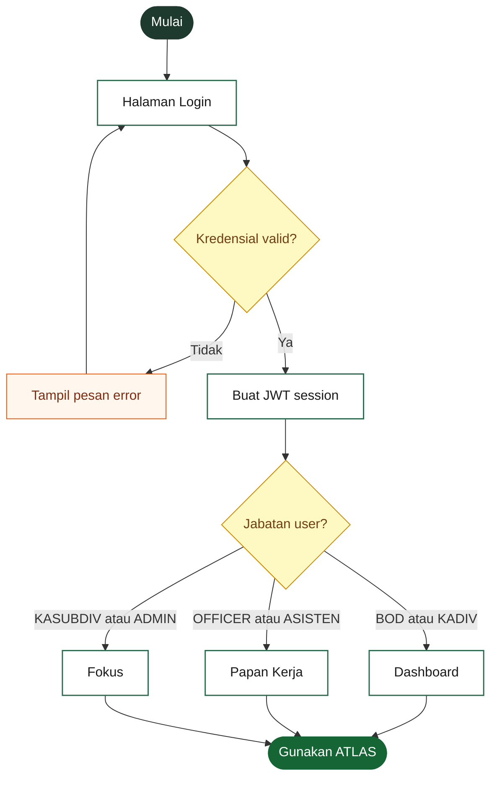
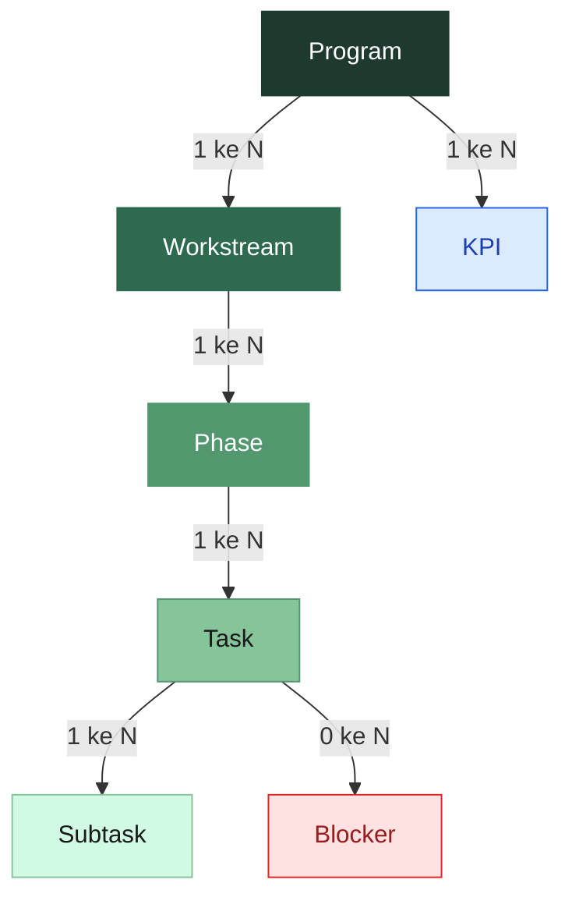
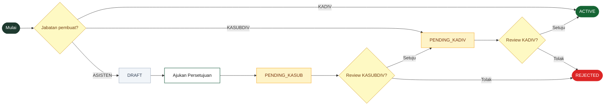
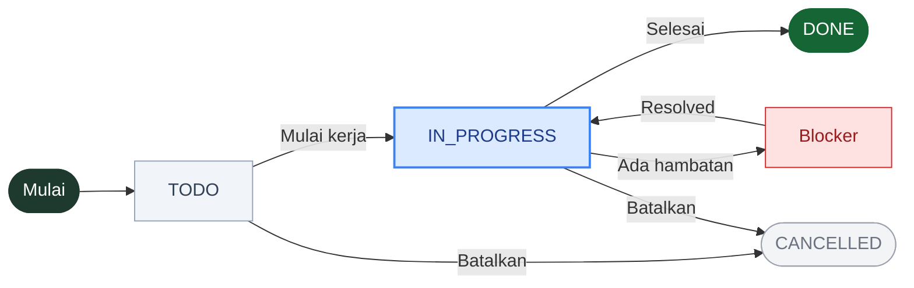
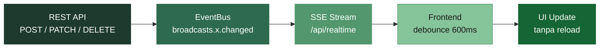
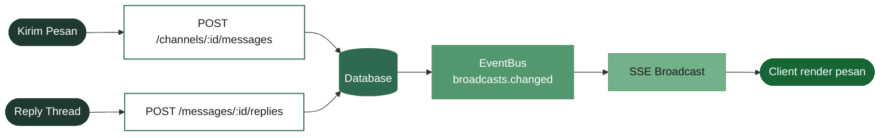

# ATLAS — Panduan Penggunaan & Evaluasi

> Panduan penggunaan ATLAS untuk seluruh tim — langkah-langkah operasional dari setiap fitur, dilengkapi catatan evaluasi implementasi untuk kebutuhan teknis.

## Referensi Jabatan

| Kode | Jabatan |
|------|---------|
| BOD | Direksi |
| KADIV | Kepala Divisi |
| KASUBDIV | Kepala Sub-Divisi |
| ASISTEN | Asisten |
| OFFICER | Staff/Officer |
| ADMIN | Admin sistem |
| SUPERADMIN | Super admin |

## Glosarium Istilah

Istilah-istilah berikut digunakan di seluruh ATLAS dan panduan ini.

| Istilah | Penjelasan |
|---------|------------|
| **Program** | Proyek atau kegiatan strategis jangka menengah/panjang. Satu Program dapat memiliki banyak Workstream. Contoh: *Audit Internal 2026*. |
| **Workstream** | Jalur kerja dalam satu Program — mengelompokkan Phase dan Task berdasarkan bidang atau tim. Contoh: *Audit Divisi Keuangan*. |
| **Phase** | Tahapan utama dalam sebuah Workstream. Mengelompokkan Task yang saling berkaitan. Tampil sebagai container bernomor di tab Workstream. Contoh: *Pengumpulan Dokumen*. |
| **Task** | Satu unit pekerjaan konkret di dalam sebuah Phase — memiliki status, assignee, prioritas, dan batas waktu. Muncul di **Papan Kerja (Execution)**. Contoh: *Kumpulkan laporan arus kas Q1*. |
| **Subtask** | Checklist langkah-langkah di dalam sebuah Task. Tidak berdiri sendiri dan tidak muncul di Papan Kerja. Contoh: *Email ke treasury minta data Januari*. |
| **Blocker** | Hambatan yang menghalangi penyelesaian task — perlu dilaporkan agar PIC & atasan dapat menindaklanjuti. |
| **PIC** | *Person in Charge* — penanggung jawab suatu task, workstream, atau program. |
| **Assignee** | Pengguna yang ditugaskan untuk mengerjakan suatu Task. |
| **RSVP** | Konfirmasi kehadiran rapat: Hadir, Tidak Hadir, atau Delegasi (menunjuk pengganti). |
| **Action Items** | Daftar tindak lanjut yang disepakati dalam rapat, lengkap dengan penanggung jawab dan batas waktu. |
| **Health Score** | Nilai otomatis (0–100) yang mencerminkan kesehatan program berdasarkan progres task dan blocker aktif. |
| **Thread** | Rangkaian balasan dalam satu pesan di Channel — agar diskusi tidak campur dengan pesan lain. |
| **KPI** | *Key Performance Indicator* — indikator kinerja terukur yang dipantau secara berkala. |

## Alur Proses Sistem

> 🔧 *Bagian ini ditujukan untuk developer TI — menggambarkan alur proses utama sistem ATLAS secara visual agar mudah dipahami saat onboarding, debugging, atau pengembangan fitur baru.*

### 1. Alur Autentikasi & Navigasi Awal

Setelah login berhasil, sistem menentukan halaman awal berdasarkan jabatan pengguna.

### 2. Hierarki Entitas Data

Hubungan antar entitas utama di ATLAS — dari Program sampai Subtask.

### 3. Alur Approval Program

Pembuatan program melewati alur persetujuan berjenjang sesuai jabatan pembuat.

### 4. Alur Eksekusi Task

Siklus hidup sebuah Task mulai dari pembuatan hingga selesai.

### 5. Alur Real-Time (SSE)

Setiap mutasi data dikirim ke semua client secara real-time via Server-Sent Events.

### 6. Alur Komunikasi (Channel & DM)

Pesan dikirim melalui REST, disimpan di database, lalu di-broadcast ke seluruh subscriber channel.

---

## 1. Masuk & Keluar Sistem

**Siapa yang bisa:** Semua pengguna

### Cara Login

1. Buka ATLAS di browser — masuk ke halaman login
2. Masukkan **email** dan **password** Anda
3. Klik tombol **Masuk**
4. Sistem akan mengarahkan Anda otomatis ke halaman utama sesuai jabatan

> 💡 **Lupa password?** Klik tautan "Lupa Password" di halaman login, masukkan email Anda, dan ikuti instruksi yang dikirimkan ke email.

### Cara Logout

1. Klik inisial/foto profil Anda di pojok kanan atas
2. Pilih **Keluar** dari menu
3. Anda akan kembali ke halaman login secara otomatis

**Status: ✅ Lengkap**

> 🔧 *Catatan teknis: Token sesi tidak memiliki expiry time — berlaku selama akun aktif di database. Halaman reset password (frontend) belum dibuat meskipun endpoint sudah tersedia.*

## 2. Halaman Utama per Jabatan

**Siapa yang bisa:** Semua pengguna

Setelah login, ATLAS akan membawa Anda ke halaman yang sesuai dengan jabatan Anda secara otomatis.

### Halaman Awal per Jabatan

| Jabatan | Halaman Awal | Alasan |
|---------|-------------|--------|
| BOD, KADIV | Dashboard | Ringkasan eksekutif & KPI |
| OFFICER, ASISTEN | Papan Kerja | Tugas harian langsung tersedia |
| KASUBDIV, ADMIN | Fokus | Inbox prioritas & tindakan pending |

### Menu yang Tersedia

Semua halaman dapat diakses melalui menu navigasi di sisi kiri layar:

- **TODAY** — Fokus: notifikasi & tugas Anda hari ini
- **STRATEGIC** — Programs & Dashboard
- **EXECUTION** — Papan Kerja
- **REPORTS** — Analytics & Laporan Bulanan
- **COMMS** — Channels, Jadwal, Pencarian
- **ACCOUNT** — Kehadiran, Profil, Pengaturan

**Status: ✅ Lengkap**

## 3. Program & Workstream

**Siapa yang bisa:** KADIV (langsung aktif) · KASUBDIV (perlu approval KADIV) · ASISTEN (perlu approval KASUBDIV → KADIV) · Semua (lihat)

Program adalah unit kerja strategis utama di ATLAS. Di dalamnya terdapat Workstream sebagai jalur kerja, Phase sebagai tahapan, dan Task sebagai unit eksekusi konkret.

### Hierarki Kerja

> **Program** → Workstream → Phase → Task → Subtask

### Contoh Nyata

| Level | Contoh | Di mana terlihat |
|-------|--------|-----------------|
| **Program** | Audit Internal 2026 | Menu Programs |
| **Workstream** | ↳ Audit Divisi Keuangan | Tab Workstream di detail Program |
| **Phase** | &nbsp;&nbsp;↳ Pengumpulan Dokumen | Tab Workstream — container bernomor |
| **Task** | &nbsp;&nbsp;&nbsp;&nbsp;↳ Kumpulkan laporan arus kas Q1 | Tab Workstream + **Papan Kerja (Execution)** |
| **Subtask** | &nbsp;&nbsp;&nbsp;&nbsp;&nbsp;&nbsp;↳ Email ke treasury minta data Januari | Detail Task saja — tidak muncul di Papan Kerja |

> 💡 **Perbedaan kunci:** Task adalah unit terkecil yang *bisa dikerjakan dan dilacak* di Papan Kerja. Phase adalah wadah pengelompokan Task dalam satu Workstream — tidak muncul di Papan Kerja. Subtask adalah checklist langkah kecil di dalam sebuah Task — tidak muncul di mana pun selain detail task itu sendiri.

### Alur Persetujuan Program

| Pembuat | Alur Approval |
|---------|--------------|
| KADIV | Langsung ACTIVE — tidak perlu approval |
| KASUBDIV | Dibuat → PENDING_KADIV → KADIV setujui → ACTIVE |
| ASISTEN | Dibuat → DRAFT → Ajukan → PENDING_KASUB → KASUBDIV setujui → PENDING_KADIV → KADIV setujui → ACTIVE |

**Status approval program:**
- **DRAFT** — dibuat ASISTEN, belum diajukan (bisa diedit, lalu klik "Ajukan Persetujuan")
- **PENDING_KASUB** — menunggu persetujuan KASUBDIV
- **PENDING_KADIV** — menunggu persetujuan KADIV
- **ACTIVE** — aktif, program berjalan normal
- **REJECTED** — ditolak, kembali ke DRAFT dengan catatan (bisa direvisi & diajukan ulang)

> 💡 Program berstatus non-ACTIVE menampilkan **banner notifikasi** di halaman detail dengan tombol aksi sesuai peran Anda.

### Cara Membuat Program Baru

1. Buka menu **Programs** di sidebar
2. Klik tombol **+ Buat Program** di pojok kanan atas
3. Isi kode, nama, deskripsi, dan tahun program
4. Klik **Simpan** — program baru akan muncul di daftar
5. Semua anggota tim akan melihat program baru secara real-time

> 💡 Setelah program dibuat, Anda dapat membuka detailnya dan menambahkan **Workstream** sebagai jalur kerja di dalamnya.

### Cara Menambah Workstream

1. Buka detail program yang dituju
2. Klik tab **Workstream**, lalu klik **+ Workstream Baru**
3. Isi nama, kode, tanggal mulai/selesai, dan pilih PIC
4. Klik **Simpan**

### Cara Menambah Phase

Phase adalah tahapan dalam sebuah Workstream. Buat Phase terlebih dahulu sebelum menambahkan Task.

1. Buka detail program → tab **Workstream**
2. Klik nama Workstream untuk membuka panel detailnya
3. Klik **+ Tambah Phase**
4. Isi nama Phase (contoh: *Fase Persiapan*, *Analisis Data*, *Penyusunan Laporan*)
5. Klik **Buat Phase**

### Cara Menambah Task

Task adalah unit kerja yang akan muncul di **Papan Kerja (Execution)** dan bisa di-assign ke anggota tim.

**Dari tab Workstream (direkomendasikan untuk task dalam Phase):**
1. Buka panel detail Workstream → klik Phase yang dituju
2. Klik **+ Tambah Task** di bawah Phase tersebut
3. Isi judul, prioritas, assignee, tanggal mulai, dan target selesai
4. Klik **Buat Task** — task muncul di Papan Kerja assignee

**Dari Papan Kerja (untuk task baru cepat):**
1. Buka menu **Execution**
2. Klik **+ Tugas Baru**
3. Pilih Workstream tujuan, isi detail, klik **Simpan**

### Aturan Edit Program

Program **tidak dapat diubah** selama dalam proses persetujuan (status `PENDING_KASUB` atau `PENDING_KADIV`). Tombol Edit akan disembunyikan otomatis. Program bisa diedit kembali setelah disetujui (`ACTIVE`) atau ditolak (`REJECTED`/`DRAFT`). ADMIN dan SUPERADMIN dapat mengedit kapan saja.

### Health Score Program

Health Score dihitung otomatis dari **tiga sinyal** dan diperbarui setiap kali ada perubahan data:

| Sinyal | Kondisi RED | Kondisi YELLOW |
|--------|-------------|----------------|
| **Workstream** | Ada ≥1 Workstream aktif berstatus RED | Ada ≥1 Workstream aktif berstatus YELLOW |
| **Risiko** | Ada ≥2 risiko HIGH terbuka | Ada ≥1 risiko HIGH terbuka |
| **KPI Internal** | ≥2 KPI di bawah ambang kritis | ≥1 KPI di bawah ambang kritis atau warning |

> **Aturan:** Sinyal terburuk menang (RED > YELLOW > GREEN). KPI hanya dihitung jika sudah ada nilai aktual yang diinput.

Health diperbarui otomatis setiap kali:
- Nilai aktual KPI diinput (`+ Input Nilai`)
- Status atau progres Task diubah
- Workstream diperbarui

### Fitur Lain di Program

- **Tab KPI** — hubungkan KPI APMS dan buat KPI internal dengan target & threshold; panel monitoring menampilkan status tiap indikator secara visual
- **Tab Diskusi** — komentar & diskusi tim dalam konteks program
- **Tab Timeline** — jadwal program secara visual
- **Health Score** — indikator kesehatan program berbasis tiga sinyal: workstream, risiko, dan KPI

**Status: ✅ Lengkap**

## 4. Papan Kerja (Workboard)

**Siapa yang bisa:** Semua pengguna (OFFICER/ASISTEN terutama)

Papan Kerja adalah tempat utama untuk mengelola dan memantau tugas harian. Tersedia dua tampilan: **Board** (kartu kanban) dan **List** (daftar).

### Cara Menggunakan Papan Kerja

1. Klik **Execution** di sidebar
2. Pilih tampilan **Board** atau **List** di bagian atas
3. Filter berdasarkan **Program** atau **Workstream** sesuai kebutuhan

### Kolom Status di Board

| Status | Arti |
|--------|------|
| BACKLOG | Tugas terdaftar, belum dimulai |
| READY | Siap dikerjakan |
| IN PROGRESS | Sedang dikerjakan |
| IN REVIEW | Menunggu review/persetujuan |
| COMPLETED | Selesai |
| CANCELLED | Dibatalkan |

### Cara Memperbarui Status Tugas

1. Klik kartu tugas yang ingin diperbarui
2. Di panel detail, ubah status menggunakan dropdown **Status**
3. Perubahan disimpan otomatis dan terlihat real-time oleh seluruh tim

### Di Panel Detail Tugas, Anda Bisa:

- Mengubah status, persentase progres, dan assignee
- Menambahkan **Subtask** sebagai checklist langkah-langkah
- Menulis komentar atau diskusi
- Melaporkan **blocker** (hambatan) jika ada

> 💡 **Tugas Saya:** Gunakan filter "My Tasks" untuk melihat hanya tugas yang ditugaskan kepada Anda.

**Status: ✅ Lengkap**

> 🔧 *Catatan teknis: Endpoint `/api/my-work` baru 397B — implementasi sangat minimal, perlu dikembangkan untuk view personal yang lebih kaya.*

## 5. Grid Ren/Real Mingguan

**Siapa yang bisa:** KADIV, BOD (baca) · KASUBDIV (input)

Grid Ren/Real adalah tampilan perbandingan **rencana** (minggu ke berapa suatu tugas seharusnya dikerjakan) vs **realisasi** (minggu berapa tugas tersebut benar-benar dikerjakan).

### Cara Mengakses Grid

1. Buka menu **Programs**, pilih program yang dituju
2. Klik tab **Execution Grid** (Tab 3)
3. Pilih **Workstream** dari selector di bagian atas
4. Grid akan menampilkan seluruh Phase dan Task dengan kolom per minggu

### Cara Membaca Warna Grid

| Warna | Arti |
|-------|------|
| 🟦 Biru | Minggu yang direncanakan (Ren) |
| 🟩 Hijau | Realisasi sesuai rencana (Real) |
| 🟨 Kuning | Realisasi melebihi rencana — ada keterlambatan |
| 🟥 Merah | Minggu yang terblokir (ada blocker aktif) |

Garis hijau vertikal menunjukkan **posisi minggu saat ini**.

> 💡 Realisasi dihitung **otomatis** dari status Task. Tidak perlu input manual untuk realisasi — sistem membacanya dari progress task.

**Status: ✅ Baca & Otomatis Lengkap**

> 🔧 *Catatan teknis: Edit manual per-cell (V2) belum ada — belum ada UI untuk mengubah `plannedWeeks` atau `actualWeeks` langsung dari grid. PRG-SGN-002 dan PRG-SGN-003 belum memiliki data Phase sehingga belum muncul di grid.*

## 6. KPI & Indikator Kinerja

**Siapa yang bisa:** KADIV, ADMIN (kelola) · BOD, KADIV (pantau) · PIC (input nilai)

KPI (Key Performance Indicator) adalah indikator kinerja yang dipantau secara berkala. ATLAS menghubungkan KPI langsung ke Program.

### Cara Melihat KPI

1. Buka **Dashboard** — widget KPI menampilkan ringkasan indikator utama
2. Atau buka **Analytics** di sidebar untuk tampilan lengkap

### Cara Menambah Nilai Realisasi KPI

1. Buka detail KPI yang dituju
2. Klik **+ Input Nilai**
3. Masukkan nilai realisasi, periode, dan catatan (opsional)
4. Klik **Simpan** — nilai tersimpan dan grafik diperbarui

### Cara Menghubungkan KPI ke Program

1. Buka detail Program
2. Pilih tab **KPI**
3. Klik **+ Hubungkan KPI**
4. Pilih KPI dari daftar, klik **Simpan**

> 💡 KPI yang terhubung ke program akan muncul di **Dashboard** sebagai leading indicator kinerja program tersebut.

**Status: ✅ Lengkap**

> 🔧 *Catatan teknis: Integrasi APMS (sinkronisasi ke/dari sistem PTPN Holding) — route ada di backend, namun implementasi frontend belum terverifikasi.*

## 7. Blocker — Hambatan Kerja

**Siapa yang bisa:** Semua (laporkan) · PIC, KADIV (resolusi/eskalasi)

Blocker adalah hambatan yang menghalangi penyelesaian suatu tugas atau program. Melaporkan blocker membantu tim mengidentifikasi dan menyelesaikan masalah lebih cepat.

### Cara Melaporkan Blocker

1. Buka detail Task yang terhambat
2. Klik **+ Tambah Blocker**
3. Isi judul, deskripsi hambatan, dan tingkat keparahan
4. Klik **Simpan** — PIC dan KADIV akan mendapat notifikasi

### Cara Menyelesaikan atau Mengeskalaasikan Blocker

1. Buka daftar blocker dari **Papan Kerja** (tab Blockers) atau dari detail Program
2. Klik blocker yang ingin ditangani
3. Pilih **Tandai Selesai** atau **Eskalasi ke atasan**
4. Tambahkan catatan penyelesaian, lalu simpan

> 💡 Setiap blocker memiliki **channel diskusi** tersendiri — Anda bisa langsung mendiskusikan hambatan tersebut bersama tim terkait tanpa keluar dari konteks blocker.

**Status: ✅ Lengkap**

## 8. Jadwal & Rapat

**Siapa yang bisa:** Semua (lihat & RSVP) · Organizer (buat & kelola)

Halaman Jadwal adalah pusat manajemen rapat — dari undangan, RSVP, notulen, hingga action items.

### Cara Membuat Rapat

1. Buka **Schedule** di sidebar
2. Klik **+ Buat Rapat**
3. Isi judul, tanggal/waktu, lokasi, dan pilih peserta
4. Hubungkan ke Program (opsional)
5. Klik **Simpan** — undangan otomatis terkirim ke semua peserta

### Cara Merespons Undangan (RSVP)

1. Anda akan menerima notifikasi undangan rapat
2. Buka notifikasi atau langsung buka halaman **Schedule**
3. Temukan rapat yang dimaksud, klik **RSVP**
4. Pilih: **Hadir**, **Tidak Hadir**, atau **Delegasi** (tunjuk pengganti)

### Saat & Setelah Rapat — Notulen & Action Items

1. Buka detail rapat dari halaman **Schedule**
2. Isi **Notulen** di kolom yang tersedia
3. Tambahkan **Keputusan** yang dihasilkan
4. Buat **Action Items** — tandai siapa yang bertanggung jawab dan kapan batas waktunya
5. Action Items dapat langsung **dijadikan Task** di Papan Kerja dengan satu klik

> 💡 Fitur **Briefing Sebelum Rapat** menampilkan otomatis: status program terkait, blocker aktif, dan action items yang belum selesai dari rapat sebelumnya.

### Status Siklus Rapat

Rapat memiliki alur status: **Terjadwal → Berlangsung → Selesai**. Rapat juga bisa **Ditunda** atau **Dibatalkan**.

### Siapa yang Bisa Melihat Rapat

| Jabatan | Hak Akses |
|---------|-----------|
| BOD, ADMIN | Semua rapat |
| KADIV | Rapat direktorat + yang diundang |
| KASUBDIV & bawah | Hanya yang diundang |

**Status: ✅ Lengkap (V1 + V2 + V3)**

> 🔧 *Catatan teknis: V4 belum tersedia — Meeting Cost (perhitungan person-hours) dan integrasi Google Calendar OAuth belum diimplementasi.*

## 9. Laporan Bulanan

**Siapa yang bisa:** KASUBDIV, KADIV (buat & submit) · KADIV, BOD (review & approve)

Laporan Bulanan adalah laporan periodik yang berisi progres dan capaian unit kerja, lengkap dengan file Excel pendukung.

### Cara Membuat Laporan Baru

1. Buka **Monthly Reports** di sidebar
2. Klik **+ Buat Laporan**
3. Pilih tahun, bulan, dan unit kerja
4. Hubungkan ke program yang relevan (opsional)
5. Klik **Simpan**

### Cara Mengunggah File Laporan

1. Buka laporan yang sudah dibuat
2. Klik **Upload File** dan pilih file Excel laporan Anda
3. Sistem akan mengekstrak data metrik dari file secara otomatis
4. Periksa hasil ekstraksi, lalu klik **Submit untuk Review**

### Cara Review & Approve Laporan

1. Anda akan mendapat notifikasi saat ada laporan masuk
2. Buka laporan dari halaman **Monthly Reports**
3. Periksa konten dan data metrik
4. Klik **Setujui** atau **Kembalikan** dengan catatan

### Alur Status Laporan

| Status | Arti |
|--------|------|
| DRAFT | Sedang disiapkan |
| SUBMITTED | Sudah disubmit, menunggu review |
| APPROVED | Disetujui |
| REJECTED | Dikembalikan untuk perbaikan |

**Status: ✅ Lengkap**

## 10. Komunikasi — Channel & Pesan Langsung

**Siapa yang bisa:** Semua pengguna

ATLAS memiliki sistem komunikasi internal — Channel untuk diskusi tim dan DM untuk pesan langsung antar pengguna.

### Menggunakan Channel

1. Buka **Channels** di sidebar
2. Pilih channel yang ingin diikuti
3. Ketik pesan di kolom bawah, tekan Enter untuk kirim
4. Balas pesan dengan klik **Balas** untuk membuat thread diskusi
5. Tambahkan reaksi emoji dengan hover di atas pesan

> 💡 Setiap **Blocker** memiliki channel diskusi otomatis — percakapan langsung tersimpan dalam konteks hambatan tersebut.

### Menggunakan Pesan Langsung (DM)

1. Klik ikon pesan atau cari pengguna via **Search**
2. Ketik dan kirim pesan secara private
3. Riwayat DM tersimpan dan bisa dicari

### Fitur Tambahan

- **Simpan Pesan** — bookmark pesan penting untuk dibaca ulang
- **Set Reminder** — ingatkan diri Anda untuk menindaklanjuti pesan tertentu
- **Preview Link** — tempel URL di pesan, sistem otomatis menampilkan preview konten

**Status: ✅ Lengkap**

## 11. Notifikasi & Fokus

**Siapa yang bisa:** Semua pengguna

Halaman **Fokus** adalah inbox prioritas Anda — semua notifikasi penting dari seluruh modul ATLAS terkumpul di sini.

### Cara Menggunakan Fokus

1. Klik **Focus** di bagian atas sidebar
2. Lihat ringkasan: tugas aktif, blocker, mention, dan program berisiko
3. Klik item apapun untuk langsung membuka konteks yang relevan
4. Klik **Tandai Dibaca** pada notifikasi yang sudah ditindaklanjuti

### Jenis Notifikasi yang Anda Terima

- Undangan rapat dan respons RSVP
- Tugas baru yang ditugaskan ke Anda
- Perubahan status tugas milik Anda
- Mention (@nama) di komentar atau pesan
- Laporan yang perlu di-review atau hasil review
- Blocker baru yang dibuat atau diselesaikan

> 💡 Angka merah di ikon lonceng di topbar menunjukkan jumlah notifikasi yang belum dibaca.

**Status: ✅ Lengkap**

## 12. Kehadiran & Status Tim

**Siapa yang bisa:** Semua (lihat & update status sendiri) · BOD, KADIV (pantau tim)

Halaman Kehadiran menampilkan siapa yang sedang online, apa yang sedang dikerjakan, dan status ketersediaan seluruh anggota tim.

### Cara Update Status Anda

1. Buka **Presence** di sidebar
2. Di panel kanan, pilih status dari daftar Quick Set:
   - Sedang bekerja, Dalam meeting, Istirahat, Work from home, dll.
3. Anda bisa menambahkan **pesan status** (misalnya: "Review laporan Q1")
4. Klik **Update Status**

### Cara Melihat Status Tim

1. Buka **Presence**
2. Tim dikelompokkan per divisi/sub-divisi
3. Status setiap anggota ditampilkan real-time — warna hijau (online), kuning (away), abu (offline)

> 💡 Status online diperbarui otomatis saat Anda membuka dan menutup ATLAS. Anda juga bisa mengatur status manual kapan saja.

**Status: ✅ Lengkap**

## 13. Pencarian

**Siapa yang bisa:** Semua pengguna

Fitur pencarian memungkinkan Anda menemukan apa saja di ATLAS dengan cepat — program, tugas, pesan, hingga anggota tim.

### Cara Mencari

1. Tekan **⌘K** (Mac) atau **Ctrl+K** (Windows) dari mana saja
2. Atau klik ikon pencarian di topbar
3. Ketik kata kunci yang dicari
4. Hasil dikelompokkan per kategori: Program, Tugas, Channel, Pengguna

**Status: ✅ Ada**

> 🔧 *Catatan teknis: Cakupan full-text search perlu diverifikasi lebih lanjut — route handler saat ini cukup ringkas (12KB).*

## 14. Administrasi Sistem

**Siapa yang bisa:** ADMIN, SUPERADMIN

Modul administrasi untuk mengelola pengguna, struktur organisasi, dan konfigurasi hak akses.

### Kelola Pengguna

1. Buka **Admin → Users**
2. Lihat daftar seluruh pengguna sistem
3. Klik **+ Tambah Pengguna** untuk mendaftarkan akun baru
4. Klik nama pengguna untuk mengedit jabatan, unit, atau role
5. Nonaktifkan akun pengguna yang sudah tidak aktif

### Kelola Struktur Organisasi

1. Buka **Admin → Organizations**
2. Tambah atau edit Direktorat, Divisi, dan Sub-Divisi
3. Perubahan langsung tercermin di seluruh modul ATLAS

### Konfigurasi Hak Akses (Role)

1. Buka **Admin → Roles** (SUPERADMIN only)
2. Lihat dan atur permission matrix per jabatan
3. Simpan — perubahan berlaku langsung tanpa restart

**Status: ✅ Lengkap**

## 15. Ringkasan Status Implementasi

Tabel berikut adalah evaluasi teknis per modul untuk keperluan developer dan evaluator.

| Modul | Backend | Frontend | Realtime | Status |
|-------|---------|----------|----------|--------|
| Login & Session | ✅ | ✅ | — | ✅ |
| Navigasi per Role | ✅ | ✅ | — | ✅ |
| Program CRUD | ✅ | ✅ | ✅ | ✅ |
| Program Approval (DRAFT→ACTIVE) | ✅ | ✅ | ✅ | ✅ |
| Workstream CRUD | ✅ | ✅ | ✅ | ✅ |
| Workstream tab info (PIC, tanggal, prioritas, blocker) | ✅ | ✅ | — | ✅ |
| Label Phase/Task/Subtask (konsistensi terminologi) | ✅ | ✅ | — | ✅ |
| Task (Papan Kerja) | ✅ | ✅ | ✅ | ✅ |
| Execution Grid (baca) | ✅ | ✅ | ✅ | ✅ |
| Execution Grid (edit cell) | ❌ | ❌ | — | ❌ V2 |
| KPI Tracking (internal + APMS link) | ✅ | ✅ | ✅ | ✅ |
| KPI-Driven Program Health | ✅ | ✅ | ✅ | ✅ |
| Integrasi APMS (live sync) | ❌ | ⚠️ | — | ⚠️ |
| Blocker | ✅ | ✅ | ✅ | ✅ |
| Meeting V1 (CRUD + RSVP) | ✅ | ✅ | ✅ | ✅ |
| Meeting V2 (Notulen + Action Items) | ✅ | ✅ | ✅ | ✅ |
| Meeting V3 (Prep Packet) | ✅ | ✅ | — | ✅ |
| Meeting V4 (Cost + Google Calendar) | ❌ | ❌ | — | ❌ |
| Focus Blocks | ✅ | ✅ | — | ✅ |
| Laporan Bulanan | ✅ | ✅ | ✅ | ✅ |
| Channels + Pesan | ✅ | ✅ | ✅ | ✅ |
| Direct Message | ✅ | ✅ | ✅ | ✅ |
| Notifikasi & Fokus | ✅ | ✅ | ✅ | ✅ |
| Kehadiran Tim | ✅ | ✅ | ✅ | ✅ |
| Pencarian | ✅ | ✅ | — | ✅ |
| Admin Users/Org/Roles | ✅ | ✅ | — | ✅ |
| My Work (personal view) | ⚠️ | ✅ | ✅ | ⚠️ |
| Realtime SSE | ✅ | ✅ | — | ✅ |

### Gap Prioritas

- ❌ **Execution Grid edit (V2)** — belum ada UI klik-sel untuk ubah rencana/realisasi manual
- ❌ **Meeting V4** — Google Calendar OAuth dan kalkulasi biaya rapat belum diimplementasi
- ❌ **APMS Live Sync** — fetch data real dari AGHRIS belum diimplementasi; KPI APMS saat ini masih menggunakan seed data. KPI internal (buat sendiri) sudah berfungsi penuh termasuk monitoring health
- ⚠️ **My Work** — endpoint minimal, perlu dikembangkan untuk view personal lebih lengkap
- ⚠️ **PRG-SGN-002 & PRG-SGN-003** — belum memiliki data Phase, tidak akan muncul di Execution Grid

**Status: ✅ Evaluasi Lengkap per 22 Apr 2026**

*Panduan ini mencerminkan kondisi implementasi ATLAS per 22 Apr 2026. Perbarui dokumen setiap ada perubahan fitur signifikan.*
