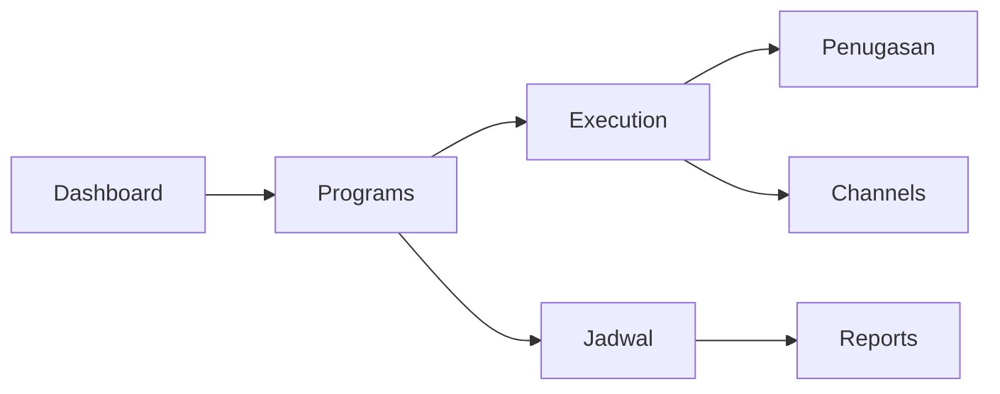

# ATLAS Playbook

> Panduan operasional singkat untuk menjalankan workflow utama ATLAS setelah migrasi Laravel, React, Inertia, dan PostgreSQL.

**Status:** ✅ Migrated baseline

## 1. Portfolio Monitoring

**Siapa yang bisa:** SUPERADMIN, ADMIN, BOD, KADIV, KASUBDIV, ASISTEN

1. Buka Dashboard untuk melihat ringkasan program, task, blocker, KPI, dan aktivitas.
2. Gunakan Programs untuk memeriksa status, health, progress, workstream, dan execution pulse.
3. Eskalasikan blocker kritis dari Execution atau Channels agar tindak lanjut tercatat.

## 2. Program Execution

**Siapa yang bisa:** SUPERADMIN, ADMIN, KADIV, KASUBDIV, ASISTEN

1. Buat atau pilih program aktif.
2. Pecah pekerjaan menjadi workstream, task, subtask, KPI, dan blocker.
3. Pantau stale task dan at-risk workstream dari execution pulse.

## 3. Assignment Workflow

**Siapa yang bisa:** SUPERADMIN, ADMIN, KADIV, KASUBDIV, ASISTEN

1. Buat penugasan dari halaman Penugasan.
2. Isi assignee, reviewer chain, prioritas, tenggat, dan bukti yang dibutuhkan.
3. Assignee mengirim hasil untuk direview.
4. Reviewer dapat approve, return, reject, cancel, atau reopen sesuai role.

## 4. Meetings and Schedule

**Siapa yang bisa:** Semua user aktif

1. Gunakan Jadwal untuk melihat rapat, focus blocks, dan rekomendasi portfolio.
2. Hubungkan rapat dengan program jika rapat membahas risiko, blocker, atau progres tertentu.
3. Catat keputusan dan action item agar muncul pada follow-up berikutnya.

## 5. Channels and Knowledge

**Siapa yang bisa:** Semua user aktif

1. Pakai Channels untuk diskusi kerja harian, mention, thread, reaction, dan saved messages.
2. Simpan pesan penting agar mudah ditemukan kembali.
3. Gunakan Search untuk mencari program, task, meeting, channel, dan saved search.

## 6. Risk and Monthly Reports

**Siapa yang bisa:** SUPERADMIN, ADMIN, BOD, KADIV, KASUBDIV

1. Gunakan Laporan Bulanan untuk laporan unit dan DIMR.
2. Gunakan Laporan Risiko untuk risk snapshot, KRI, mitigation, governance, dan approval.
3. Pastikan periode dan unit unik sebelum submit approval.

## Reference

| Area | Primary Page | Key Data |
|---|---|---|
| Portfolio | Dashboard, Programs | Program, Workstream, Task, Blocker |
| Execution | Execution, Penugasan | Assignment, Evidence, Approval |
| Collaboration | Channels, Jadwal | Message, Meeting, Notification |
| Reporting | Laporan Bulanan, Laporan Risiko | MonthlyReport, RiskMonthlyReport |

